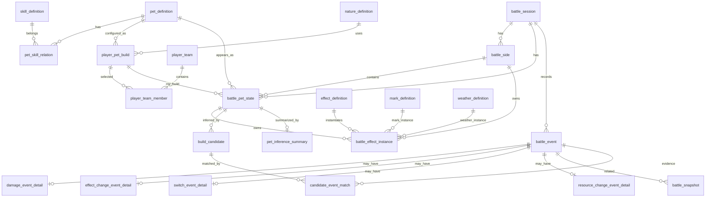

# 洛克王国世界 PVP 战斗信息获取与敌方配置推算系统设计文档 v0.2

> 基于需求分析 v0.3.3 修订  
> 本版重点：本地应用、前后端分离、Web 界面、技术栈筛选、详细数据库设计  
> 推荐落地形态：本地 Web 应用 + 本地后端服务 + SQLite 本地数据库 + 可选桌面壳封装  
> 文档日期：2026-05-10

---

## 0. 版本说明

相较 v0.1，本版做了以下调整：

1. 明确系统做成 **本地应用**，但采用 **前后端分离架构**。
2. 明确 UI 采用 **Web 界面**，后续可以用 Tauri 封装为桌面应用。
3. 补充技术栈筛选，并给出推荐组合。
4. 将数据库设计从“结构建议”细化为可直接落地的表设计。
5. 将数据库分为五类：静态规则库、用户配置库、战斗运行时库、事件与快照库、推算结果库。
6. 明确所有关键字段的含义、类型、必填性、来源、约束和开发注释。
7. 保留需求文档中的关键约束：
   - 精灵基础字段使用唯一 ID、名称、头像，不设置精灵别名字段。
   - 多段伤害 MVP 默认只记录最终显示总伤害，逐段伤害作为可选扩展。
   - 星陨属于减益印记，绑定队伍侧减益印记槽，切换不清除。
   - 伤害推算必须使用事件发生瞬间的统一状态快照。
   - 手动输入优先级高于自动识别和系统推算。

---

## 1. 系统定位

本系统是一个面向《洛克王国世界》PVP 对战的本地辅助分析工具。

系统不负责自动替玩家操作或决策，而是负责：

1. 维护精灵、技能、状态、印记、天气等规则数据。
2. 在准备阶段记录双方阵容。
3. 根据敌方精灵种类生成敌方候选配置集合。
4. 在战斗过程中记录技能、伤害、血量变化、状态变化、切换、天气、印记等事件。
5. 通过完整状态快照计算伤害。
6. 根据伤害事件持续过滤敌方候选配置。
7. 展示伤害区间、生命百分比、速度先手概率和敌方配置置信度。
8. 支持事件纠错、重放和重新推算。

---

## 2. 本地前后端分离方案

### 2.1 总体形态

系统采用本地运行方式：

```text
用户电脑
├─ Web 前端
│  ├─ 战斗看板
│  ├─ 事件录入
│  ├─ 状态编辑
│  ├─ 候选配置展示
│  └─ 规则数据维护
│
├─ 本地后端服务
│  ├─ REST API
│  ├─ 战斗状态引擎
│  ├─ 伤害计算器
│  ├─ 速度判断器
│  ├─ 候选配置生成器
│  ├─ 敌方配置推算引擎
│  └─ 事件重放引擎
│
├─ 本地数据库
│  └─ SQLite app.db
│
└─ 本地资源目录
   ├─ 精灵头像
   ├─ 技能图标
   ├─ 状态图标
   ├─ 识别模板，第二阶段使用
   └─ 日志 / 导出文件
```

### 2.2 运行方式

第一阶段开发时：

```text
前端：localhost:5173
后端：127.0.0.1:8000
数据库：本地 app.db
```

打包阶段建议：

```text
Tauri 桌面壳
  ├─ 内置前端静态资源
  ├─ 启动本地后端进程
  ├─ 打开本地 WebView
  └─ 只允许访问 127.0.0.1 本地 API
```

也可以先不封装桌面壳，直接提供：

```text
start-app.bat / start-app.sh
  ├─ 启动后端
  ├─ 打开浏览器
  └─ 自动创建或迁移数据库
```

### 2.3 为什么仍然前后端分离

虽然是本地应用，但前后端分离仍然有明显收益：

1. UI 复杂，Web 前端更适合快速做战斗看板、候选列表、事件表格和状态编辑器。
2. 计算逻辑复杂，放在后端便于单元测试、缓存、批量推算和后续性能优化。
3. 后续图像识别、OCR、规则导入、批量推算更适合在后端处理。
4. 前端专注交互，后端专注规则、状态和推算，边界清晰。
5. 将来如果需要云同步，只需要增加远端 API，不需要推翻本地核心逻辑。

---

## 3. 技术栈筛选

### 3.1 候选方案对比

| 方案                   | 前端                      | 后端                            | 数据库                    | 打包方式         | 优点                                           | 缺点                                       | 结论       |
| ---------------------- | ------------------------- | ------------------------------- | ------------------------- | ---------------- | ---------------------------------------------- | ------------------------------------------ | ---------- |
| A：Python 后端方案     | React + TypeScript + Vite | FastAPI + Pydantic + SQLAlchemy | SQLite                    | Tauri 可选       | 算法开发快，规则推算容易写，后续图像识别生态好 | 前后端语言不同，需要维护 API 类型          | 推荐       |
| B：全 TypeScript 方案  | React + TypeScript + Vite | NestJS / Fastify                | SQLite + Drizzle / Prisma | Tauri / Electron | 前后端同语言，类型共享好                       | 复杂推算和图像识别生态不如 Python 顺手     | 备选       |
| C：Java 后端方案       | Vue / React               | Spring Boot                     | SQLite / H2               | 独立本地服务     | 工程规范强，长期维护稳                         | 本地小工具偏重，启动和打包成本较高         | 不优先     |
| D：纯前端方案          | React + IndexedDB         | 无                              | IndexedDB                 | PWA / Tauri      | 部署简单                                       | 算法、事件回放、复杂查询、后续识别扩展受限 | 不建议     |
| E：Electron 一体化方案 | React                     | Node.js                         | SQLite                    | Electron         | 桌面能力强，生态成熟                           | 包体大，占用高，本项目不需要复杂桌面 API   | 可作为备用 |

### 3.2 推荐技术栈

本项目推荐采用方案 A：

```text
前端：React + TypeScript + Vite + Ant Design + Zustand + TanStack Query
后端：Python + FastAPI + Pydantic + SQLAlchemy + Alembic
数据库：SQLite
桌面封装：Tauri 2，第二阶段或打包阶段引入
测试：pytest + Vitest + Playwright
代码规范：ruff + mypy + eslint + prettier
```

### 3.3 前端技术选型

#### 3.3.1 React + TypeScript + Vite

选择理由：

1. 系统 UI 会包含大量状态面板、表格、筛选、弹窗、快速录入和实时刷新，React 适合组件化拆分。
2. TypeScript 能降低字段复杂导致的前端错误。
3. Vite 开发启动快，适合本地应用快速迭代。
4. 后续如果接入 Tauri，Vite 产物可以直接作为前端静态资源打包。

#### 3.3.2 UI 组件库：Ant Design

选择理由：

1. 本系统偏工具型 / 控制台型 UI，而不是营销页面。
2. 需要大量表格、表单、标签、抽屉、弹窗、树形选择、Tabs、Segmented、Tooltip。
3. Ant Design 中文资料多，适合快速开发复杂后台界面。

可替代方案：

- Arco Design：同样适合中后台，风格更现代。
- Naive UI：如果前端选择 Vue，可以考虑。

#### 3.3.3 状态管理

推荐：

```text
Zustand：管理当前战斗 UI 临时状态。
TanStack Query：管理后端 API 请求、缓存、刷新和错误状态。
```

不要把整场战斗状态长期只存在前端 store 中。前端状态只是展示和交互缓存，权威状态应以后端事件日志和数据库为准。

#### 3.3.4 图表与可视化

推荐：

```text
ECharts：候选数量变化、伤害区间、速度概率、置信度趋势。
```

第一阶段不是必须，但建议预留。

### 3.4 后端技术选型

#### 3.4.1 FastAPI

选择理由：

1. 适合本地 REST API。
2. Pydantic 类型校验适合复杂事件、状态、快照数据。
3. 自动生成 OpenAPI 文档，便于前后端对接。
4. Python 更适合后续接入图像识别、OCR、批量数据处理和推算算法。
5. 单机本地运行时性能足够，计算压力主要来自候选枚举，可通过缓存和聚合优化。

#### 3.4.2 SQLAlchemy + Alembic

选择理由：

1. SQLAlchemy 适合维护明确的数据表和关系。
2. Alembic 用于本地数据库迁移，避免用户升级版本时丢数据。
3. 对 JSON 字段、索引、事务、批量写入支持较好。

#### 3.4.3 Pydantic 模型分层

建议后端至少分三类模型：

```text
ORM Model：数据库表映射。
Schema Model：API 入参 / 出参。
Domain Model：计算和推算过程中使用的领域对象。
```

不要直接把 ORM 对象传入推算引擎，避免数据库结构和算法结构强耦合。

### 3.5 数据库选型

推荐 SQLite。

选择理由：

1. 本地应用不需要用户安装数据库服务。
2. 单文件 app.db 方便备份、迁移和导出。
3. 支持事务，适合事件日志和状态快照。
4. 支持 JSON 字段，适合保存 effect_script、damage_rule、snapshot 等半结构化数据。
5. 支持 FTS5，可用于精灵、技能、状态搜索。

不推荐 PostgreSQL 作为第一阶段数据库，因为它需要额外安装服务，违背本地轻量应用目标。

不推荐 MongoDB，因为本系统存在大量明确关系：精灵、技能、状态、战斗、事件、候选配置之间需要稳定关联和事务。

### 3.6 桌面封装选型

推荐第二阶段使用 Tauri 2。

选择理由：

1. 可以保留 Web 技术栈。
2. 包体通常比 Electron 小。
3. 适合本地工具类应用。
4. 可以管理本地文件、数据库目录、后端进程启动和应用更新。

第一阶段可以先不接入 Tauri，直接用浏览器访问本地后端，降低开发复杂度。

---

## 4. 推荐项目结构

```text
rock-pvp-helper/
├─ apps/
│  ├─ web/                         # 前端 React 应用
│  │  ├─ src/
│  │  │  ├─ pages/
│  │  │  ├─ components/
│  │  │  ├─ features/
│  │  │  │  ├─ battle/
│  │  │  │  ├─ rule-data/
│  │  │  │  ├─ candidates/
│  │  │  │  └─ event-log/
│  │  │  ├─ api/
│  │  │  ├─ stores/
│  │  │  ├─ types/
│  │  │  └─ utils/
│  │  └─ package.json
│  │
│  └─ desktop/                     # Tauri 壳，第二阶段加入
│     ├─ src-tauri/
│     └─ tauri.conf.json
│
├─ services/
│  └─ api/                         # FastAPI 后端
│     ├─ app/
│     │  ├─ main.py
│     │  ├─ api/
│     │  ├─ db/
│     │  ├─ models/                # ORM
│     │  ├─ schemas/               # API Schema
│     │  ├─ domain/                # 领域对象
│     │  ├─ services/
│     │  │  ├─ battle_session.py
│     │  │  ├─ state_engine.py
│     │  │  ├─ snapshot_service.py
│     │  │  ├─ stat_calculator.py
│     │  │  ├─ damage_calculator.py
│     │  │  ├─ candidate_generator.py
│     │  │  └─ inference_engine.py
│     │  └─ rules/
│     ├─ migrations/               # Alembic
│     ├─ tests/
│     └─ pyproject.toml
│
├─ data/
│  ├─ seed/                        # 初始规则数据
│  ├─ assets/                      # 头像、图标
│  └─ examples/                    # 示例战斗
│
├─ docs/
│  ├─ system-design.md
│  ├─ database-design.md
│  └─ api-design.md
│
└─ scripts/
   ├─ start-dev.sh
   ├─ start-dev.bat
   └─ import-rule-data.py
```

---

## 5. 系统模块设计

### 5.1 前端模块

| 模块         | 职责                                       | 主要页面 / 组件                   |
| ------------ | ------------------------------------------ | --------------------------------- |
| 规则数据维护 | 维护精灵、技能、状态、印记、天气、克制关系 | PetAdmin、SkillAdmin、EffectAdmin |
| 己方配置管理 | 保存玩家自己的精灵配置和队伍               | MyBuildList、TeamBuilder          |
| 准备阶段     | 录入双方六只精灵，初始化敌方候选           | PreparationPage                   |
| 战斗看板     | 展示当前对位、血量、能量、状态、天气、印记 | BattleDashboard                   |
| 快速事件录入 | 快速录入技能、伤害、状态、切换             | EventInputPanel                   |
| 状态编辑器   | 修改当前效果实例、层数、持续时间、来源     | EffectEditor                      |
| 伤害面板     | 展示我方 / 敌方技能伤害区间和击杀判断      | DamagePreviewPanel                |
| 速度面板     | 展示速度区间、同速情况、先手概率           | SpeedJudgePanel                   |
| 候选配置面板 | 展示候选数量、属性区间、置信度、排除原因   | CandidatePanel                    |
| 事件日志     | 按回合展示事件，支持修正和回放             | EventLogPanel                     |

### 5.2 后端模块

| 模块                 | 职责                       | 关键输出                                         |
| -------------------- | -------------------------- | ------------------------------------------------ |
| RuleDataService      | 查询静态规则数据           | PetDefinition、SkillDefinition、EffectDefinition |
| BattleSessionService | 管理战斗生命周期           | BattleSession                                    |
| EventService         | 事件创建、校验、纠错       | BattleEvent                                      |
| BattleStateEngine    | 根据事件维护运行时状态     | 当前 BattleState                                 |
| SnapshotService      | 保存事件发生瞬间快照       | BattleSnapshot                                   |
| StatCalculator       | 面板属性和战斗有效属性计算 | StatResult                                       |
| DamageCalculator     | 技能伤害和生命百分比计算   | DamageCalculationResult                          |
| CandidateGenerator   | 生成敌方候选配置           | BuildCandidate                                   |
| InferenceEngine      | 根据伤害事件过滤候选       | CandidateUpdateResult                            |
| SpeedJudgeService    | 速度区间和先手概率         | SpeedJudgeResult                                 |
| ReplayService        | 根据事件日志重放战斗       | RebuiltBattleState                               |
| ExportService        | 导出战斗记录和规则数据     | JSON / Markdown / CSV                            |

---

## 6. 数据库设计总则

### 6.1 数据库文件

```text
app.db
```

建议存放位置：

```text
Windows: %APPDATA%/RockPvpHelper/app.db
macOS: ~/Library/Application Support/RockPvpHelper/app.db
Linux: ~/.local/share/RockPvpHelper/app.db
```

开发环境可放在：

```text
./local-data/app.db
```

### 6.2 表分类

| 分类         | 说明                                       | 示例表                                                   |
| ------------ | ------------------------------------------ | -------------------------------------------------------- |
| 静态规则表   | 游戏规则本身，主要由开发者或数据维护者录入 | pet_definition、skill_definition、effect_definition      |
| 用户配置表   | 用户自己维护的己方精灵配置和队伍           | player_pet_build、player_team                            |
| 战斗运行时表 | 某场战斗当前状态，可由事件回放重建         | battle_session、battle_pet_state、battle_effect_instance |
| 事件与快照表 | 记录发生过的事实和当时快照                 | battle_event、damage_event_detail、battle_snapshot       |
| 推算结果表   | 候选配置、候选证据、技能可能性             | build_candidate、candidate_event_match                   |
| 扩展识别表   | 第二阶段用于图像识别和 OCR                 | recognition_template、recognition_result                 |

### 6.3 字段命名规则

| 规则         | 说明                                                |
| ------------ | --------------------------------------------------- |
| 表名         | 小写蛇形命名，例如 `battle_event`                   |
| 字段名       | 小写蛇形命名，例如 `pet_id`                         |
| 主键         | 统一使用 `id` 或业务主键，例如 `pet_id`、`skill_id` |
| 外键         | 使用被引用对象名 + `_id`                            |
| JSON 字段    | 后缀建议为 `_json`，例如 `damage_rule_json`         |
| 时间字段     | 使用 `created_at`、`updated_at`、`deleted_at`       |
| 置信度字段   | 统一使用 `confidence`，范围 0 到 1                  |
| 来源字段     | 统一使用 `source`                                   |
| 是否手动修正 | 统一使用 `manual_override`                          |

### 6.4 SQLite 类型建议

| 逻辑类型 | SQLite 类型 | 说明                           |
| -------- | ----------- | ------------------------------ |
| string   | TEXT        | ID、名称、枚举、说明文本       |
| int      | INTEGER     | 数值、层数、回合数、布尔值     |
| decimal  | REAL        | 百分比、权重、置信度、倍率     |
| bool     | INTEGER     | 0 表示 false，1 表示 true      |
| datetime | TEXT        | ISO 8601 字符串                |
| json     | TEXT        | 存储 JSON 字符串，由应用层校验 |

### 6.5 通用字段

多数业务表建议包含：

| 字段       | 类型 | 必填 | 说明                                   |
| ---------- | ---- | ---- | -------------------------------------- |
| created_at | TEXT | 是   | 创建时间，ISO 8601。                   |
| updated_at | TEXT | 是   | 最后更新时间，ISO 8601。               |
| deleted_at | TEXT | 否   | 软删除时间。静态规则表一般不物理删除。 |

### 6.6 数据来源枚举

| 枚举值            | 含义       | 使用场景                                   |
| ----------------- | ---------- | ------------------------------------------ |
| database_rule     | 数据库规则 | 精灵、技能、状态、天气、印记等静态数据。   |
| manual_input      | 手动输入   | 用户录入或修正，优先级最高。               |
| auto_recognition  | 自动识别   | 第二阶段图像识别或 OCR 结果。              |
| system_calculated | 系统计算   | 面板属性、伤害、速度等计算结果。           |
| system_inferred   | 系统推算   | 敌方配置、未知技能、状态可能性等推断结果。 |
| imported          | 导入数据   | 从外部 JSON / CSV 导入的规则。             |

---

# 7. 静态规则表设计

## 7.1 精灵定义表：`pet_definition`

### 用途

记录精灵的基础种族信息、系别、头像、可学习技能和常见配置。敌方准备阶段只确认精灵种类时，系统根据此表读取种族资质、系别、技能池，并生成候选配置。

### 设计重点

- `pet_id` 是精灵唯一主键。
- `pet_name` 用于展示和搜索，不作为复杂关联依据。
- 当前不设置 `alias_names` 字段。
- `avatar` 必填，用于 UI 展示和后续识别。

### 字段说明

| 字段                                   | 类型    | 必填 | 默认值   | 约束 / 索引  | 来源              | 注释                                                         |
| -------------------------------------- | ------- | ---- | -------- | ------------ | ----------------- | ------------------------------------------------------------ |
| pet_id                                 | TEXT    | 是   | 无       | PK           | 数据库录入        | 精灵唯一 ID。所有配置、事件、候选均引用该字段。建议稳定不变。 |
| pet_name                               | TEXT    | 是   | 无       | UNIQUE INDEX | 数据库录入        | 精灵标准名称。用于 UI 展示和搜索。当前不维护别名字段。       |
| avatar                                 | TEXT    | 是   | 无       | 无           | 资源维护          | 头像资源 ID、相对路径或本地文件名。准备阶段识别和 UI 展示依赖该字段。 |
| element_types_json                     | TEXT    | 是   | `[]`     | JSON 校验    | 数据库录入        | 系别数组。支持单系 / 双系，例如 `["water", "dragon"]`。      |
| base_hp_talent                         | INTEGER | 是   | 无       | CHECK >= 0   | 数据库录入        | 生命种族资质。参与 PVP 面板生命计算。                        |
| base_physical_attack_talent            | INTEGER | 是   | 无       | CHECK >= 0   | 数据库录入        | 物攻种族资质。                                               |
| base_physical_defense_talent           | INTEGER | 是   | 无       | CHECK >= 0   | 数据库录入        | 物防种族资质。                                               |
| base_magic_attack_talent               | INTEGER | 是   | 无       | CHECK >= 0   | 数据库录入        | 魔攻种族资质。                                               |
| base_magic_defense_talent              | INTEGER | 是   | 无       | CHECK >= 0   | 数据库录入        | 魔防种族资质。                                               |
| base_speed_talent                      | INTEGER | 是   | 无       | CHECK >= 0   | 数据库录入        | 速度种族资质。用于速度候选和先手概率。                       |
| learnable_skill_ids_json               | TEXT    | 是   | `[]`     | JSON 校验    | 数据库录入        | 可学习技能 ID 数组。敌方技能未知时的枚举上限。               |
| common_skill_sets_json                 | TEXT    | 否   | `[]`     | JSON 校验    | 数据库录入 / 统计 | 常见技能组。只用于排序和初始权重，不应直接排除冷门技能。     |
| common_natures_json                    | TEXT    | 否   | `[]`     | JSON 校验    | 数据库录入 / 统计 | 常见性格及权重。用于候选初始权重。                           |
| common_individual_talent_patterns_json | TEXT    | 否   | `[]`     | JSON 校验    | 数据库录入 / 统计 | 常见个体资质维度和数值组合。用于候选初始权重。               |
| forms_json                             | TEXT    | 否   | `[]`     | JSON 校验    | 数据库录入        | 形态、皮肤、同名不同形态说明。若种族资质不同，建议拆成不同 pet_id。 |
| recognition_templates_json             | TEXT    | 否   | `[]`     | JSON 校验    | 图像识别维护      | 头像模板、颜色特征、识别区域。第二阶段使用。                 |
| data_source                            | TEXT    | 否   | null     | 无           | 数据维护          | 数据来源说明。                                               |
| data_version                           | TEXT    | 是   | `v1`     | INDEX        | 数据维护          | 规则版本。游戏平衡调整后更新。                               |
| note                                   | TEXT    | 否   | null     | 无           | 数据维护          | 维护备注。                                                   |
| created_at                             | TEXT    | 是   | 当前时间 | 无           | 系统维护          | 创建时间。                                                   |
| updated_at                             | TEXT    | 是   | 当前时间 | 无           | 系统维护          | 更新时间。                                                   |

### 索引建议

```sql
CREATE UNIQUE INDEX idx_pet_definition_name ON pet_definition(pet_name);
CREATE INDEX idx_pet_definition_data_version ON pet_definition(data_version);
```

---

## 7.2 性格定义表：`nature_definition`

### 用途

记录性格对六维属性的正负修正。当前规则为一个正面维度 1.2，一个负面维度 0.9，其他维度 1.0，且正负维度不能相同。

### 字段说明

| 字段                | 类型 | 必填 | 默认值   | 约束 / 索引        | 来源       | 注释                                                         |
| ------------------- | ---- | ---- | -------- | ------------------ | ---------- | ------------------------------------------------------------ |
| nature_id           | TEXT | 是   | 无       | PK                 | 数据库录入 | 性格唯一 ID。可使用 `atk_up_matk_down` 这类规则 ID。         |
| nature_name         | TEXT | 是   | 无       | UNIQUE INDEX       | 数据库录入 | 性格显示名称。若暂未整理官方名称，可使用规则名。             |
| positive_stat       | TEXT | 是   | 无       | CHECK in stat enum | 数据库录入 | 正面修正维度，可取 hp、physical_attack、physical_defense、magic_attack、magic_defense、speed。 |
| positive_multiplier | REAL | 是   | 1.2      | CHECK > 0          | 数据库录入 | 正面倍率，当前固定 1.2。                                     |
| negative_stat       | TEXT | 是   | 无       | CHECK in stat enum | 数据库录入 | 负面修正维度，不能与 positive_stat 相同。                    |
| negative_multiplier | REAL | 是   | 0.9      | CHECK > 0          | 数据库录入 | 负面倍率，当前固定 0.9。                                     |
| neutral_multiplier  | REAL | 是   | 1.0      | CHECK > 0          | 数据库录入 | 未被正负修正影响时的倍率，当前固定 1.0。                     |
| data_version        | TEXT | 是   | `v1`     | INDEX              | 数据维护   | 规则版本。                                                   |
| created_at          | TEXT | 是   | 当前时间 | 无                 | 系统维护   | 创建时间。                                                   |
| updated_at          | TEXT | 是   | 当前时间 | 无                 | 系统维护   | 更新时间。                                                   |

---

## 7.3 技能定义表：`skill_definition`

### 用途

记录技能基础信息、伤害规则、多段规则、技能效果脚本和识别模板。伤害计算、状态变化、敌方技能枚举都依赖该表。

### 字段说明

| 字段                      | 类型    | 必填 | 默认值       | 约束 / 索引  | 来源         | 注释                                                         |
| ------------------------- | ------- | ---- | ------------ | ------------ | ------------ | ------------------------------------------------------------ |
| skill_id                  | TEXT    | 是   | 无           | PK           | 数据库录入   | 技能唯一 ID。事件、状态来源、技能槽均引用该字段。            |
| skill_name                | TEXT    | 是   | 无           | UNIQUE INDEX | 数据库录入   | 技能标准名称。                                               |
| alias_names_json          | TEXT    | 否   | `[]`         | JSON 校验    | 数据维护     | 技能别名或 OCR 常见误识别名。注意：精灵不维护别名，但技能可维护别名。 |
| skill_icon                | TEXT    | 否   | null         | 无           | 资源维护     | 技能图标路径或资源 ID。                                      |
| element_type              | TEXT    | 是   | 无           | INDEX        | 数据库录入   | 技能系别。用于属性克制、天气和同系规则。                     |
| skill_category            | TEXT    | 是   | 无           | INDEX        | 数据库录入   | 技能分类：physical、magic、status、special。                 |
| base_power                | INTEGER | 否   | null         | CHECK >= 0   | 数据库录入   | 基础威力。状态技能或特殊公式技能可为空。                     |
| base_energy_cost          | INTEGER | 是   | 0            | CHECK >= 0   | 数据库录入   | 基础能耗。实际能耗需叠加技能槽修正和状态效果。               |
| priority_modifier         | INTEGER | 是   | 0            | 无           | 数据库录入   | 先手修正。普通技能为 0。                                     |
| tags_json                 | TEXT    | 否   | `[]`         | JSON 校验    | 数据维护     | 标签，如 quick、charge、multi_hit、mark_related、weather_setter。 |
| damage_rule_json          | TEXT    | 否   | null         | JSON 校验    | 数据库录入   | 伤害规则。攻击技能必填，纯状态技能可为空。                   |
| hit_rule_json             | TEXT    | 否   | null         | JSON 校验    | 数据库录入   | 多段 / 连击规则。非多段可为 `{ "is_multi_hit": false }`。    |
| effect_script_json        | TEXT    | 否   | `[]`         | JSON 校验    | 数据库录入   | 技能效果原子操作列表。状态技能和附加状态攻击技能都需要维护。 |
| recognition_template_json | TEXT    | 否   | null         | JSON 校验    | 图像识别维护 | 技能图标、名称、位置识别模板。第二阶段使用。                 |
| runtime_record_mode       | TEXT    | 是   | `total_only` | CHECK enum   | 系统配置     | 多段运行时记录策略：total_only、hit_optional、hit_required。MVP 默认 total_only。 |
| data_source               | TEXT    | 否   | null         | 无           | 数据维护     | 数据来源说明。                                               |
| data_version              | TEXT    | 是   | `v1`         | INDEX        | 数据维护     | 技能数据版本。                                               |
| note                      | TEXT    | 否   | null         | 无           | 数据维护     | 维护备注，例如取整规则待实测。                               |
| created_at                | TEXT    | 是   | 当前时间     | 无           | 系统维护     | 创建时间。                                                   |
| updated_at                | TEXT    | 是   | 当前时间     | 无           | 系统维护     | 更新时间。                                                   |

### `damage_rule_json` 建议结构

```json
{
  "damage_type": "normal_formula",
  "attack_stat": "physical_attack",
  "defense_stat": "physical_defense",
  "power_source": "base_power",
  "fixed_damage_value": null,
  "percent_damage_base": null,
  "ignore_defense": false,
  "ignore_type_effectiveness": false,
  "can_critical": false,
  "affected_by_attack_stat_stage": true,
  "affected_by_defense_stat_stage": true,
  "affected_by_weather": true,
  "affected_by_mark": true,
  "affected_by_abnormal": true,
  "affected_by_damage_modifier": true,
  "rounding_policy": "unknown",
  "special_formula_id": null
}
```

### `hit_rule_json` 建议结构

```json
{
  "is_multi_hit": true,
  "hit_count_type": "fixed",
  "fixed_hit_count": 3,
  "min_hit_count": null,
  "max_hit_count": null,
  "hit_count_modifier_source": null,
  "per_hit_independent_calculation": null,
  "per_hit_independent_rounding": null,
  "per_hit_effect_script": [],
  "total_damage_displayed": true,
  "runtime_record_mode": "total_only"
}
```

### 索引建议

```sql
CREATE UNIQUE INDEX idx_skill_definition_name ON skill_definition(skill_name);
CREATE INDEX idx_skill_definition_element_type ON skill_definition(element_type);
CREATE INDEX idx_skill_definition_category ON skill_definition(skill_category);
```

---

## 7.4 精灵技能关系表：`pet_skill_relation`

### 用途

虽然 `pet_definition.learnable_skill_ids_json` 可以保存技能数组，但建议额外维护关系表，方便查询“哪些精灵会某个技能”和后续做统计。

### 字段说明

| 字段           | 类型    | 必填 | 默认值   | 约束 / 索引 | 来源       | 注释                                       |
| -------------- | ------- | ---- | -------- | ----------- | ---------- | ------------------------------------------ |
| id             | TEXT    | 是   | 无       | PK          | 系统生成   | 关系记录 ID。                              |
| pet_id         | TEXT    | 是   | 无       | FK, INDEX   | 数据库录入 | 精灵 ID，引用 pet_definition.pet_id。      |
| skill_id       | TEXT    | 是   | 无       | FK, INDEX   | 数据库录入 | 技能 ID，引用 skill_definition.skill_id。  |
| is_common      | INTEGER | 是   | 0        | CHECK 0/1   | 数据维护   | 是否常见技能。只影响权重，不作为排除依据。 |
| default_weight | REAL    | 是   | 1.0      | CHECK >= 0  | 数据维护   | 初始技能权重。常见技能可更高。             |
| note           | TEXT    | 否   | null     | 无          | 数据维护   | 备注。                                     |
| created_at     | TEXT    | 是   | 当前时间 | 无          | 系统维护   | 创建时间。                                 |

### 索引建议

```sql
CREATE UNIQUE INDEX idx_pet_skill_unique ON pet_skill_relation(pet_id, skill_id);
CREATE INDEX idx_pet_skill_skill ON pet_skill_relation(skill_id);
```

---

## 7.5 战斗效果定义表：`effect_definition`

### 用途

统一记录普通增益 / 减益、异常 / 层数状态、技能槽修正、行动规则状态、特殊机制等持续效果。印记和天气可以有独立表，但也可以在此表中有对应 effect_id。

### 字段说明

| 字段                       | 类型    | 必填 | 默认值           | 约束 / 索引 | 来源       | 注释                                                         |
| -------------------------- | ------- | ---- | ---------------- | ----------- | ---------- | ------------------------------------------------------------ |
| effect_id                  | TEXT    | 是   | 无               | PK          | 数据库录入 | 效果唯一 ID。运行时效果实例引用该字段。                      |
| effect_name                | TEXT    | 是   | 无               | INDEX       | 数据库录入 | 效果名称，如冻结、物攻提升、技能能耗增加。                   |
| category                   | TEXT    | 是   | 无               | INDEX       | 数据库录入 | 分类：normal_buff、normal_debuff、abnormal_stack、skill_slot_modifier、action_rule、resource_settlement、state_operation、special_mechanism。 |
| polarity                   | TEXT    | 是   | `neutral`        | CHECK enum  | 数据库录入 | 正负性：positive、negative、neutral、mixed。                 |
| default_scope              | TEXT    | 是   | 无               | CHECK enum  | 数据库录入 | 默认作用范围：active_pet、target_pet、bench_pet、side、battlefield、skill_slot、turn。 |
| max_layers                 | INTEGER | 否   | null             | CHECK > 0   | 数据库录入 | 最大层数。无层数效果可为空或 1。                             |
| stack_rule                 | TEXT    | 是   | `refresh`        | CHECK enum  | 数据库录入 | 叠层规则：stack、refresh、replace、ignore、max。             |
| duration_type              | TEXT    | 是   | `until_removed`  | CHECK enum  | 数据库录入 | 持续方式：turns、uses、until_switch、until_dispel、permanent、until_battle_end、instant。 |
| default_duration_turns     | INTEGER | 否   | null             | CHECK >= 0  | 数据库录入 | 默认持续回合数。                                             |
| default_duration_uses      | INTEGER | 否   | null             | CHECK >= 0  | 数据库录入 | 默认持续次数。                                               |
| clear_on_switch            | INTEGER | 是   | 0                | CHECK 0/1   | 数据库录入 | 切换当前在场精灵时是否清除。普通增减益多为 1；冻结、印记、天气为 0。 |
| clear_by_normal_dispel     | INTEGER | 是   | 0                | CHECK 0/1   | 数据库录入 | 是否可被普通驱散增益 / 减益处理。                            |
| clear_by_mark_dispel       | INTEGER | 是   | 0                | CHECK 0/1   | 数据库录入 | 是否可被印记驱散处理。印记类效果为 1。                       |
| clear_by_abnormal_cleanse  | INTEGER | 是   | 0                | CHECK 0/1   | 数据库录入 | 是否可被异常清除技能处理。                                   |
| calculation_hooks_json     | TEXT    | 否   | `[]`             | JSON 校验   | 数据库录入 | 参与哪些计算：stat、damage、energy_cost、power、hit_count、priority、action_limit。 |
| stat_modifiers_json        | TEXT    | 否   | `[]`             | JSON 校验   | 数据库录入 | 属性修正，例如物攻 +100%、速度 -90。                         |
| damage_modifiers_json      | TEXT    | 否   | `[]`             | JSON 校验   | 数据库录入 | 增伤、减伤、吸血、反伤等修正。                               |
| skill_cost_modifiers_json  | TEXT    | 否   | `[]`             | JSON 校验   | 数据库录入 | 技能能耗修正。                                               |
| action_rule_modifiers_json | TEXT    | 否   | `[]`             | JSON 校验   | 数据库录入 | 先手、迅捷、蓄力、眩晕、无法更换等行动规则。                 |
| icon_id                    | TEXT    | 否   | null             | 无          | 资源维护   | 状态图标资源 ID。                                            |
| is_visible_icon            | INTEGER | 是   | 1                | CHECK 0/1   | 数据库录入 | 是否在 UI 常驻显示图标。瞬时资源变化通常为 0。               |
| display_group              | TEXT    | 是   | `pet_status_bar` | CHECK enum  | UI 配置    | UI 展示分区：pet_status_bar、side_mark_bar、battlefield_top、skill_slot_badge、bench_panel、event_log_only。 |
| data_version               | TEXT    | 是   | `v1`             | INDEX       | 数据维护   | 效果规则版本。                                               |
| note                       | TEXT    | 否   | null             | 无          | 数据维护   | 特殊规则、待实测说明。                                       |
| created_at                 | TEXT    | 是   | 当前时间         | 无          | 系统维护   | 创建时间。                                                   |
| updated_at                 | TEXT    | 是   | 当前时间         | 无          | 系统维护   | 更新时间。                                                   |

---

## 7.6 印记定义表：`mark_definition`

### 用途

单独记录队伍侧印记。每个队伍最多同时存在一个增益印记槽和一个减益印记槽。印记切换不清除，只有明确驱散、转换、消除印记的技能才能处理。

### 字段说明

| 字段                   | 类型    | 必填 | 默认值        | 约束 / 索引             | 来源                | 注释                                                         |
| ---------------------- | ------- | ---- | ------------- | ----------------------- | ------------------- | ------------------------------------------------------------ |
| mark_id                | TEXT    | 是   | 无            | PK                      | 数据库录入          | 印记唯一 ID。星陨也在此定义。                                |
| mark_name              | TEXT    | 是   | 无            | UNIQUE INDEX            | 数据库录入          | 印记名称，如蓄势印记、星陨。                                 |
| polarity               | TEXT    | 是   | 无            | CHECK positive/negative | 数据库录入          | 印记方向。增益印记占 positive_mark_slot，减益印记占 negative_mark_slot。 |
| linked_effect_id       | TEXT    | 否   | null          | FK                      | 数据库录入          | 若该印记也作为 BattleEffect 参与计算，可关联 effect_definition.effect_id。 |
| max_layers             | INTEGER | 否   | null          | CHECK > 0               | 数据库录入          | 最大层数。未知时可为空，但运行时应允许层数记录。             |
| stack_rule             | TEXT    | 是   | `stack`       | CHECK enum              | 数据库录入          | 同名印记再次获得时的叠加规则。                               |
| conflict_policy        | TEXT    | 是   | `replace_old` | CHECK enum              | 数据库录入 / 待实测 | 同槽不同名印记冲突策略：replace_old、reject_new、merge、manual_confirm。默认 replace_old。 |
| clear_on_switch        | INTEGER | 是   | 0             | CHECK = 0               | 数据库录入          | 固定为 0。印记不因切换清除。                                 |
| clear_by_mark_dispel   | INTEGER | 是   | 1             | CHECK 0/1               | 数据库录入          | 是否可被印记驱散技能处理。                                   |
| calculation_hooks_json | TEXT    | 否   | `[]`          | JSON 校验               | 数据库录入          | 印记对伤害、速度、属性、技能等计算的影响。                   |
| icon_id                | TEXT    | 否   | null          | 无                      | 资源维护            | 印记图标。                                                   |
| data_version           | TEXT    | 是   | `v1`          | INDEX                   | 数据维护            | 数据版本。                                                   |
| note                   | TEXT    | 否   | null          | 无                      | 数据维护            | 特殊说明，例如星陨为减益印记。                               |
| created_at             | TEXT    | 是   | 当前时间      | 无                      | 系统维护            | 创建时间。                                                   |
| updated_at             | TEXT    | 是   | 当前时间      | 无                      | 系统维护            | 更新时间。                                                   |

### 星陨规则落库建议

```text
mark_id = xingyun
mark_name = 星陨
polarity = negative
clear_on_switch = 0
conflict_policy = replace_old
stack_rule = stack
```

---

## 7.7 天气定义表：`weather_definition`

### 用途

记录全战场天气 / 战场状态。同一时间只存在一个天气，新天气替换旧天气。天气不随精灵切换清除。

### 字段说明

| 字段                   | 类型    | 必填 | 默认值                         | 约束 / 索引  | 来源       | 注释                                                         |
| ---------------------- | ------- | ---- | ------------------------------ | ------------ | ---------- | ------------------------------------------------------------ |
| weather_id             | TEXT    | 是   | 无                             | PK           | 数据库录入 | 天气唯一 ID，如 snowstorm、sandstorm、rain。                 |
| weather_name           | TEXT    | 是   | 无                             | UNIQUE INDEX | 数据库录入 | 天气名称，如暴风雪、沙暴、雨天。                             |
| linked_effect_id       | TEXT    | 否   | null                           | FK           | 数据库录入 | 若天气作为 BattleEffect 参与计算，可关联 effect_definition。 |
| conflict_policy        | TEXT    | 是   | `replace_old`                  | CHECK enum   | 数据库录入 | 天气冲突策略。当前建议新天气替换旧天气。                     |
| duration_type          | TEXT    | 是   | `until_replaced_or_battle_end` | CHECK enum   | 数据库录入 | 持续方式。未知持续时间时按直到被替换或战斗结束处理。         |
| default_duration_turns | INTEGER | 否   | null                           | CHECK >= 0   | 数据库录入 | 若天气有固定持续回合，则填写。                               |
| calculation_hooks_json | TEXT    | 否   | `[]`                           | JSON 校验    | 数据库录入 | 天气参与伤害、属性、状态结算等计算的钩子。                   |
| icon_id                | TEXT    | 否   | null                           | 无           | 资源维护   | 天气图标。                                                   |
| data_version           | TEXT    | 是   | `v1`                           | INDEX        | 数据维护   | 数据版本。                                                   |
| note                   | TEXT    | 否   | null                           | 无           | 数据维护   | 特殊说明。                                                   |
| created_at             | TEXT    | 是   | 当前时间                       | 无           | 系统维护   | 创建时间。                                                   |
| updated_at             | TEXT    | 是   | 当前时间                       | 无           | 系统维护   | 更新时间。                                                   |

---

## 7.8 属性克制表：`type_effectiveness_rule`

### 用途

记录技能系别对精灵系别的倍率。双系目标可按游戏规则组合倍率。

### 字段说明

| 字段                 | 类型 | 必填 | 默认值   | 约束 / 索引 | 来源       | 注释           |
| -------------------- | ---- | ---- | -------- | ----------- | ---------- | -------------- |
| id                   | TEXT | 是   | 无       | PK          | 系统生成   | 规则记录 ID。  |
| attack_element_type  | TEXT | 是   | 无       | INDEX       | 数据库录入 | 攻击技能系别。 |
| defense_element_type | TEXT | 是   | 无       | INDEX       | 数据库录入 | 防御精灵系别。 |
| multiplier           | REAL | 是   | 1.0      | CHECK >= 0  | 数据库录入 | 克制倍率。     |
| data_version         | TEXT | 是   | `v1`     | INDEX       | 数据维护   | 数据版本。     |
| note                 | TEXT | 否   | null     | 无          | 数据维护   | 特殊说明。     |
| created_at           | TEXT | 是   | 当前时间 | 无          | 系统维护   | 创建时间。     |
| updated_at           | TEXT | 是   | 当前时间 | 无          | 系统维护   | 更新时间。     |

### 索引建议

```sql
CREATE UNIQUE INDEX idx_type_effectiveness_unique
ON type_effectiveness_rule(attack_element_type, defense_element_type, data_version);
```

---

# 8. 用户配置表设计

## 8.1 己方精灵配置表：`player_pet_build`

### 用途

记录玩家己方精灵的完整配置。己方配置是确定的，是伤害计算和敌方反推的基础。

### 字段说明

| 字段                   | 类型    | 必填 | 默认值   | 约束 / 索引 | 来源     | 注释                                                         |
| ---------------------- | ------- | ---- | -------- | ----------- | -------- | ------------------------------------------------------------ |
| build_id               | TEXT    | 是   | 无       | PK          | 系统生成 | 己方配置 ID。                                                |
| build_name             | TEXT    | 是   | 无       | INDEX       | 手动输入 | 用户自定义配置名，例如“高速物攻版”。                         |
| pet_id                 | TEXT    | 是   | 无       | FK, INDEX   | 手动输入 | 精灵 ID。                                                    |
| level                  | INTEGER | 是   | 60       | CHECK = 60  | 系统规则 | PVP 固定 60。保留字段便于未来变动。                          |
| nature_id              | TEXT    | 是   | 无       | FK          | 手动输入 | 性格 ID。                                                    |
| individual_talent_json | TEXT    | 是   | 无       | JSON 校验   | 手动输入 | 六维个体资质，例如 `{ "hp": 10, "physical_attack": 9, ... }`。不存在个体资质的维度填 0。 |
| skill_ids_json         | TEXT    | 是   | `[]`     | JSON 校验   | 手动输入 | 当前携带技能 ID 数组。                                       |
| final_stats_json       | TEXT    | 是   | 无       | JSON 校验   | 系统计算 | 面板六维缓存。由属性计算器生成，不建议手动改。               |
| is_favorite            | INTEGER | 是   | 0        | CHECK 0/1   | 手动输入 | 是否常用配置。                                               |
| note                   | TEXT    | 否   | null     | 无          | 手动输入 | 用户备注。                                                   |
| created_at             | TEXT    | 是   | 当前时间 | 无          | 系统维护 | 创建时间。                                                   |
| updated_at             | TEXT    | 是   | 当前时间 | 无          | 系统维护 | 更新时间。                                                   |
| deleted_at             | TEXT    | 否   | null     | 无          | 系统维护 | 软删除时间。                                                 |

---

## 8.2 己方队伍表：`player_team`

### 用途

保存玩家常用六只精灵队伍，方便准备阶段快速选择。

### 字段说明

| 字段        | 类型    | 必填 | 默认值   | 约束 / 索引 | 来源     | 注释           |
| ----------- | ------- | ---- | -------- | ----------- | -------- | -------------- |
| team_id     | TEXT    | 是   | 无       | PK          | 系统生成 | 队伍 ID。      |
| team_name   | TEXT    | 是   | 无       | INDEX       | 手动输入 | 队伍名称。     |
| description | TEXT    | 否   | null     | 无          | 手动输入 | 队伍说明。     |
| is_default  | INTEGER | 是   | 0        | CHECK 0/1   | 手动输入 | 是否默认队伍。 |
| created_at  | TEXT    | 是   | 当前时间 | 无          | 系统维护 | 创建时间。     |
| updated_at  | TEXT    | 是   | 当前时间 | 无          | 系统维护 | 更新时间。     |
| deleted_at  | TEXT    | 否   | null     | 无          | 系统维护 | 软删除时间。   |

---

## 8.3 己方队伍成员表：`player_team_member`

### 用途

记录一个队伍中的六只精灵配置。

### 字段说明

| 字段           | 类型    | 必填 | 默认值   | 约束 / 索引 | 来源     | 注释                       |
| -------------- | ------- | ---- | -------- | ----------- | -------- | -------------------------- |
| id             | TEXT    | 是   | 无       | PK          | 系统生成 | 队伍成员记录 ID。          |
| team_id        | TEXT    | 是   | 无       | FK, INDEX   | 手动输入 | 队伍 ID。                  |
| build_id       | TEXT    | 是   | 无       | FK, INDEX   | 手动输入 | 己方精灵配置 ID。          |
| position_index | INTEGER | 是   | 无       | CHECK 1-6   | 手动输入 | 队伍位置。准备阶段展示用。 |
| created_at     | TEXT    | 是   | 当前时间 | 无          | 系统维护 | 创建时间。                 |

### 索引建议

```sql
CREATE UNIQUE INDEX idx_team_member_position ON player_team_member(team_id, position_index);
CREATE UNIQUE INDEX idx_team_member_build ON player_team_member(team_id, build_id);
```

---

# 9. 战斗运行时表设计

> 注意：运行时表保存当前状态，方便 UI 查询；但权威历史应以事件日志为准。发生纠错时，可以从事件日志重放并重建运行时表。

## 9.1 战斗会话表：`battle_session`

### 用途

记录一场战斗的基本信息和当前阶段。

### 字段说明

| 字段                      | 类型    | 必填 | 默认值         | 约束 / 索引 | 来源     | 注释                                            |
| ------------------------- | ------- | ---- | -------------- | ----------- | -------- | ----------------------------------------------- |
| battle_id                 | TEXT    | 是   | 无             | PK          | 系统生成 | 战斗 ID。所有运行时、事件、候选均引用该字段。   |
| battle_name               | TEXT    | 否   | null           | INDEX       | 手动输入 | 战斗名称，便于历史记录查看。                    |
| phase                     | TEXT    | 是   | `preparation`  | CHECK enum  | 系统维护 | 阶段：preparation、battle、finished、archived。 |
| turn_number               | INTEGER | 是   | 0              | CHECK >= 0  | 系统维护 | 当前回合数。准备阶段为 0。                      |
| current_action_order      | INTEGER | 是   | 0              | CHECK >= 0  | 系统维护 | 当前回合内事件顺序。                            |
| my_active_pet_state_id    | TEXT    | 否   | null           | FK          | 系统维护 | 我方当前上场精灵运行时状态 ID。                 |
| enemy_active_pet_state_id | TEXT    | 否   | null           | FK          | 系统维护 | 敌方当前上场精灵运行时状态 ID。                 |
| current_weather_id        | TEXT    | 否   | null           | FK          | 系统维护 | 当前天气 ID。也可从 battlefield_state 查询。    |
| rule_data_version         | TEXT    | 是   | `v1`           | INDEX       | 系统维护 | 本场战斗使用的规则数据版本。用于旧战斗解释。    |
| source                    | TEXT    | 是   | `manual_input` | CHECK enum  | 系统记录 | 战斗创建来源。                                  |
| note                      | TEXT    | 否   | null           | 无          | 手动输入 | 备注。                                          |
| created_at                | TEXT    | 是   | 当前时间       | 无          | 系统维护 | 创建时间。                                      |
| updated_at                | TEXT    | 是   | 当前时间       | 无          | 系统维护 | 更新时间。                                      |
| finished_at               | TEXT    | 否   | null           | 无          | 系统维护 | 战斗结束时间。                                  |

---

## 9.2 战斗队伍侧表：`battle_side`

### 用途

记录一场战斗中的我方和敌方两侧信息。

### 字段说明

| 字段                      | 类型 | 必填 | 默认值   | 约束 / 索引    | 来源     | 注释                                              |
| ------------------------- | ---- | ---- | -------- | -------------- | -------- | ------------------------------------------------- |
| side_id                   | TEXT | 是   | 无       | PK             | 系统生成 | 队伍侧 ID。                                       |
| battle_id                 | TEXT | 是   | 无       | FK, INDEX      | 系统生成 | 所属战斗。                                        |
| side_type                 | TEXT | 是   | 无       | CHECK my/enemy | 系统生成 | my 表示我方，enemy 表示敌方。                     |
| display_name              | TEXT | 否   | null     | 无             | 手动输入 | 侧名称，例如“我方”“敌方”。                        |
| positive_mark_instance_id | TEXT | 否   | null     | FK             | 状态引擎 | 当前增益印记效果实例 ID。一个队伍侧最多一个。     |
| negative_mark_instance_id | TEXT | 否   | null     | FK             | 状态引擎 | 当前减益印记效果实例 ID。星陨在这里作为减益印记。 |
| created_at                | TEXT | 是   | 当前时间 | 无             | 系统维护 | 创建时间。                                        |
| updated_at                | TEXT | 是   | 当前时间 | 无             | 系统维护 | 更新时间。                                        |

### 索引建议

```sql
CREATE UNIQUE INDEX idx_battle_side_unique ON battle_side(battle_id, side_type);
```

---

## 9.3 战斗精灵状态表：`battle_pet_state`

### 用途

记录某场战斗中某只精灵的运行时状态。己方精灵引用确定配置，敌方精灵引用 pet_id 并关联候选配置。

### 字段说明

| 字段                     | 类型    | 必填 | 默认值   | 约束 / 索引    | 来源                | 注释                                                         |
| ------------------------ | ------- | ---- | -------- | -------------- | ------------------- | ------------------------------------------------------------ |
| pet_state_id             | TEXT    | 是   | 无       | PK             | 系统生成            | 战斗内精灵状态 ID。一个 pet_id 在同一场战斗中有一个状态记录。 |
| battle_id                | TEXT    | 是   | 无       | FK, INDEX      | 系统生成            | 所属战斗。                                                   |
| side_id                  | TEXT    | 是   | 无       | FK, INDEX      | 系统生成            | 所属队伍侧。                                                 |
| side_type                | TEXT    | 是   | 无       | CHECK my/enemy | 系统生成            | 冗余字段，便于查询。                                         |
| position_index           | INTEGER | 是   | 无       | CHECK 1-6      | 准备阶段输入        | 队伍位置。                                                   |
| pet_id                   | TEXT    | 是   | 无       | FK, INDEX      | 准备阶段输入        | 精灵 ID。                                                    |
| build_id                 | TEXT    | 否   | null     | FK             | 手动输入            | 己方精灵对应 player_pet_build；敌方通常为空。                |
| is_active                | INTEGER | 是   | 0        | CHECK 0/1      | 状态引擎            | 是否当前上场。                                               |
| is_fainted               | INTEGER | 是   | 0        | CHECK 0/1      | 手动输入 / 状态引擎 | 是否已倒下。                                                 |
| level                    | INTEGER | 是   | 60       | CHECK = 60     | 系统规则            | PVP 固定等级。                                               |
| current_hp_value         | INTEGER | 否   | null     | CHECK >= 0     | 手动输入 / 系统推算 | 当前生命值。敌方可能未知，可为空。                           |
| current_hp_percent       | REAL    | 否   | null     | CHECK 0-100    | 手动输入 / 识别     | 当前生命百分比。敌方通常优先记录百分比。                     |
| estimated_max_hp_value   | INTEGER | 否   | null     | CHECK >= 0     | 系统推算            | 根据候选和伤害百分比推算出的最大生命。                       |
| current_energy           | INTEGER | 否   | null     | CHECK >= 0     | 手动输入 / 识别     | 当前能量。                                                   |
| panel_stats_json         | TEXT    | 否   | null     | JSON 校验      | 系统计算            | 己方为确定面板；敌方可保存已确认或候选聚合后的面板摘要。     |
| confirmed_stats_json     | TEXT    | 否   | null     | JSON 校验      | 系统推算 / 手动确认 | 敌方已确认六维属性。未确认时为空。                           |
| possible_skill_ids_json  | TEXT    | 否   | `[]`     | JSON 校验      | 规则库 / 推算       | 敌方仍可能携带的技能集合。                                   |
| confirmed_skill_ids_json | TEXT    | 否   | `[]`     | JSON 校验      | 手动输入 / 识别     | 已确认敌方技能。                                             |
| speed_range_json         | TEXT    | 否   | null     | JSON 校验      | 推算引擎            | 敌方速度候选范围和分布。                                     |
| confidence               | REAL    | 是   | 0        | CHECK 0-1      | 推算引擎            | 该精灵配置整体确认程度。                                     |
| last_update_event_id     | TEXT    | 否   | null     | FK             | 状态引擎            | 最近一次影响该状态的事件。                                   |
| created_at               | TEXT    | 是   | 当前时间 | 无             | 系统维护            | 创建时间。                                                   |
| updated_at               | TEXT    | 是   | 当前时间 | 无             | 系统维护            | 更新时间。                                                   |

### 索引建议

```sql
CREATE UNIQUE INDEX idx_battle_pet_state_position ON battle_pet_state(battle_id, side_type, position_index);
CREATE INDEX idx_battle_pet_state_pet ON battle_pet_state(pet_id);
CREATE INDEX idx_battle_pet_state_active ON battle_pet_state(battle_id, side_type, is_active);
```

---

## 9.4 技能槽运行时表：`battle_skill_slot_state`

### 用途

记录某只精灵当前技能槽状态。用于能耗变化、技能位置交换、技能替换、冷却、使用次数、技能变形等效果。

### 字段说明

| 字段                     | 类型    | 必填 | 默认值   | 约束 / 索引 | 来源            | 注释                                                        |
| ------------------------ | ------- | ---- | -------- | ----------- | --------------- | ----------------------------------------------------------- |
| skill_slot_state_id      | TEXT    | 是   | 无       | PK          | 系统生成        | 技能槽状态 ID。                                             |
| battle_id                | TEXT    | 是   | 无       | FK, INDEX   | 系统生成        | 所属战斗。                                                  |
| pet_state_id             | TEXT    | 是   | 无       | FK, INDEX   | 系统生成        | 所属精灵状态。                                              |
| slot_index               | INTEGER | 是   | 无       | CHECK 1-4   | 手动输入 / 配置 | 技能槽位置。                                                |
| original_skill_id        | TEXT    | 否   | null     | FK          | 配置 / 识别     | 原始技能 ID。                                               |
| current_skill_id         | TEXT    | 否   | null     | FK          | 状态引擎        | 当前技能 ID。技能替换或变形后可能不同于 original_skill_id。 |
| base_energy_cost         | INTEGER | 否   | null     | CHECK >= 0  | 规则库          | 基础能耗缓存。                                              |
| current_energy_cost      | INTEGER | 否   | null     | CHECK >= 0  | 状态引擎        | 当前实际能耗，受技能槽效果影响。                            |
| cooldown_remaining_turns | INTEGER | 是   | 0        | CHECK >= 0  | 状态引擎        | 剩余冷却回合。                                              |
| remaining_uses           | INTEGER | 否   | null     | CHECK >= 0  | 状态引擎        | 剩余使用次数。无限制时为空。                                |
| slot_effects_json        | TEXT    | 否   | `[]`     | JSON 校验   | 状态引擎        | 作用于该技能槽的效果实例 ID 或摘要。                        |
| created_at               | TEXT    | 是   | 当前时间 | 无          | 系统维护        | 创建时间。                                                  |
| updated_at               | TEXT    | 是   | 当前时间 | 无          | 系统维护        | 更新时间。                                                  |

### 索引建议

```sql
CREATE UNIQUE INDEX idx_skill_slot_unique ON battle_skill_slot_state(battle_id, pet_state_id, slot_index);
```

---

## 9.5 战斗效果实例表：`battle_effect_instance`

### 用途

记录某场战斗中实际存在的效果实例。所有普通增益、异常、技能槽修正、行动规则、印记、天气都可以通过该表统一管理。

### 字段说明

| 字段                      | 类型    | 必填 | 默认值         | 约束 / 索引 | 来源                  | 注释                                                         |
| ------------------------- | ------- | ---- | -------------- | ----------- | --------------------- | ------------------------------------------------------------ |
| effect_instance_id        | TEXT    | 是   | 无             | PK          | 系统生成              | 运行时效果实例 ID。                                          |
| battle_id                 | TEXT    | 是   | 无             | FK, INDEX   | 系统生成              | 所属战斗。                                                   |
| effect_id                 | TEXT    | 是   | 无             | FK, INDEX   | 规则库                | 效果定义 ID。                                                |
| effect_name_cache         | TEXT    | 是   | 无             | 无          | 规则库缓存            | 效果名称缓存，便于日志展示。                                 |
| category                  | TEXT    | 是   | 无             | INDEX       | 规则库缓存            | 效果分类缓存。                                               |
| polarity                  | TEXT    | 是   | `neutral`      | CHECK enum  | 规则库缓存            | 正负性。                                                     |
| scope                     | TEXT    | 是   | 无             | CHECK enum  | 状态引擎              | 实际作用范围。可能覆盖默认 scope。                           |
| owner_side_id             | TEXT    | 否   | null           | FK, INDEX   | 状态引擎              | 所属队伍侧。队伍印记、天气等可能只绑定 side 或 battlefield。 |
| owner_pet_state_id        | TEXT    | 否   | null           | FK, INDEX   | 状态引擎              | 所属精灵状态。普通增减益和异常通常绑定该字段。               |
| target_pet_state_id       | TEXT    | 否   | null           | FK, INDEX   | 状态引擎              | 目标精灵状态。某些效果需要区分来源和目标。                   |
| skill_slot_state_id       | TEXT    | 否   | null           | FK, INDEX   | 状态引擎              | 技能槽效果绑定的技能槽。                                     |
| mark_id                   | TEXT    | 否   | null           | FK          | 状态引擎              | 如果该效果是印记，对应 mark_definition.mark_id。             |
| weather_id                | TEXT    | 否   | null           | FK          | 状态引擎              | 如果该效果是天气，对应 weather_definition.weather_id。       |
| layers                    | INTEGER | 是   | 1              | CHECK >= 0  | 状态引擎              | 当前层数。无层数效果为 1。                                   |
| max_layers                | INTEGER | 否   | null           | CHECK > 0   | 规则库缓存            | 最大层数。                                                   |
| duration_type             | TEXT    | 是   | 无             | CHECK enum  | 规则库缓存 / 状态引擎 | 持续方式。                                                   |
| remaining_turns           | INTEGER | 否   | null           | CHECK >= 0  | 状态引擎              | 剩余回合。                                                   |
| remaining_uses            | INTEGER | 否   | null           | CHECK >= 0  | 状态引擎              | 剩余次数。                                                   |
| clear_on_switch           | INTEGER | 是   | 0              | CHECK 0/1   | 规则库缓存            | 切换清除标记。切换处理时直接读取实例字段。                   |
| clear_by_normal_dispel    | INTEGER | 是   | 0              | CHECK 0/1   | 规则库缓存            | 普通驱散可清除。                                             |
| clear_by_mark_dispel      | INTEGER | 是   | 0              | CHECK 0/1   | 规则库缓存            | 印记驱散可清除。                                             |
| clear_by_abnormal_cleanse | INTEGER | 是   | 0              | CHECK 0/1   | 规则库缓存            | 异常清除可清除。                                             |
| calculation_hooks_json    | TEXT    | 否   | `[]`           | JSON 校验   | 规则库缓存            | 该效果参与的计算钩子。                                       |
| runtime_payload_json      | TEXT    | 否   | `{}`           | JSON 校验   | 状态引擎              | 运行时附加数据，例如来源条件、动态倍率、绑定技能等。         |
| source_skill_id           | TEXT    | 否   | null           | FK          | 事件推导              | 来源技能。                                                   |
| source_pet_state_id       | TEXT    | 否   | null           | FK          | 事件推导              | 来源精灵。                                                   |
| source_event_id           | TEXT    | 否   | null           | FK, INDEX   | 事件推导              | 产生该效果的事件。                                           |
| is_active                 | INTEGER | 是   | 1              | CHECK 0/1   | 状态引擎              | 是否仍然生效。被清除后置 0。                                 |
| removed_event_id          | TEXT    | 否   | null           | FK          | 状态引擎              | 清除该效果的事件。                                           |
| source                    | TEXT    | 是   | `manual_input` | CHECK enum  | 输入模块              | 来源：manual_input、auto_recognition、system_calculated。    |
| confidence                | REAL    | 是   | 1.0            | CHECK 0-1   | 输入模块              | 效果识别或录入置信度。                                       |
| manual_override           | INTEGER | 是   | 0              | CHECK 0/1   | 输入模块              | 是否被用户手动修正。                                         |
| created_at                | TEXT    | 是   | 当前时间       | 无          | 系统维护              | 创建时间。                                                   |
| updated_at                | TEXT    | 是   | 当前时间       | 无          | 系统维护              | 更新时间。                                                   |

### 索引建议

```sql
CREATE INDEX idx_effect_instance_battle_active ON battle_effect_instance(battle_id, is_active);
CREATE INDEX idx_effect_instance_owner_pet ON battle_effect_instance(owner_pet_state_id, is_active);
CREATE INDEX idx_effect_instance_owner_side ON battle_effect_instance(owner_side_id, is_active);
CREATE INDEX idx_effect_instance_category ON battle_effect_instance(battle_id, category, is_active);
```

---

## 9.6 战场状态表：`battlefield_state`

### 用途

保存某场战斗当前全战场状态，尤其是天气。天气也可作为 effect_instance，但单独表便于快速读取。

### 字段说明

| 字段                               | 类型 | 必填 | 默认值   | 约束 / 索引 | 来源     | 注释                         |
| ---------------------------------- | ---- | ---- | -------- | ----------- | -------- | ---------------------------- |
| battlefield_state_id               | TEXT | 是   | 无       | PK          | 系统生成 | 战场状态 ID。                |
| battle_id                          | TEXT | 是   | 无       | UNIQUE FK   | 系统生成 | 所属战斗。                   |
| current_weather_id                 | TEXT | 否   | null     | FK          | 状态引擎 | 当前天气 ID。                |
| current_weather_effect_instance_id | TEXT | 否   | null     | FK          | 状态引擎 | 当前天气效果实例 ID。        |
| battlefield_effects_json           | TEXT | 否   | `[]`     | JSON 校验   | 状态引擎 | 其他全战场效果实例 ID。      |
| updated_by_event_id                | TEXT | 否   | null     | FK          | 状态引擎 | 最近一次更新战场状态的事件。 |
| created_at                         | TEXT | 是   | 当前时间 | 无          | 系统维护 | 创建时间。                   |
| updated_at                         | TEXT | 是   | 当前时间 | 无          | 系统维护 | 更新时间。                   |

---

# 10. 事件与快照表设计

## 10.1 战斗事件主表：`battle_event`

### 用途

保存所有关键事件。事件是系统的事实来源。当前状态、快照和推算结果都可以由事件日志重放得到。

### 字段说明

| 字段                | 类型    | 必填 | 默认值         | 约束 / 索引 | 来源                | 注释                                                         |
| ------------------- | ------- | ---- | -------------- | ----------- | ------------------- | ------------------------------------------------------------ |
| event_id            | TEXT    | 是   | 无             | PK          | 系统生成            | 事件唯一 ID。                                                |
| battle_id           | TEXT    | 是   | 无             | FK, INDEX   | 系统生成            | 所属战斗。                                                   |
| turn_number         | INTEGER | 是   | 0              | INDEX       | 手动输入 / 状态引擎 | 回合编号。                                                   |
| action_order        | INTEGER | 是   | 0              | INDEX       | 状态引擎            | 回合内顺序。用于精确回放。                                   |
| timestamp           | TEXT    | 是   | 当前时间       | INDEX       | 系统生成            | 事件发生时间。                                               |
| event_type          | TEXT    | 是   | 无             | INDEX       | 输入模块            | 事件类型：battle_start、lineup_confirmed、pet_switch、skill_used、damage、effect_change、resource_change、weather_change、mark_change、manual_correction、turn_start、turn_end。 |
| actor_side_id       | TEXT    | 否   | null           | FK          | 输入模块            | 行动方队伍侧。                                               |
| actor_pet_state_id  | TEXT    | 否   | null           | FK          | 输入模块            | 行动方精灵状态。                                             |
| target_side_id      | TEXT    | 否   | null           | FK          | 输入模块            | 目标队伍侧。                                                 |
| target_pet_state_id | TEXT    | 否   | null           | FK          | 输入模块            | 目标精灵状态。                                               |
| skill_id            | TEXT    | 否   | null           | FK          | 输入模块            | 相关技能 ID。非技能事件可为空。                              |
| snapshot_before_id  | TEXT    | 否   | null           | FK          | 快照服务            | 事件发生前快照。伤害推算通常至少需要 before 快照。           |
| snapshot_after_id   | TEXT    | 否   | null           | FK          | 快照服务            | 事件发生后快照。便于回放和解释。                             |
| payload_json        | TEXT    | 否   | `{}`           | JSON 校验   | 输入模块            | 通用负载。对简单事件可直接保存细节；复杂事件也会有 detail 表。 |
| source              | TEXT    | 是   | `manual_input` | CHECK enum  | 输入模块            | 事件来源。                                                   |
| confidence          | REAL    | 是   | 1.0            | CHECK 0-1   | 输入模块            | 事件整体置信度。手动确认通常为 1。                           |
| manual_override     | INTEGER | 是   | 0              | CHECK 0/1   | 输入模块            | 是否被用户手动修正。                                         |
| corrected_event_id  | TEXT    | 否   | null           | FK          | 纠错模块            | 如果本事件是修正事件，指向被修正事件。                       |
| is_reverted         | INTEGER | 是   | 0              | CHECK 0/1   | 纠错模块            | 该事件是否被后续修正废弃。                                   |
| note                | TEXT    | 否   | null           | 无          | 手动输入            | 事件备注。                                                   |
| created_at          | TEXT    | 是   | 当前时间       | 无          | 系统维护            | 创建时间。                                                   |

### 索引建议

```sql
CREATE INDEX idx_battle_event_order ON battle_event(battle_id, turn_number, action_order);
CREATE INDEX idx_battle_event_type ON battle_event(battle_id, event_type);
CREATE INDEX idx_battle_event_actor ON battle_event(actor_pet_state_id);
CREATE INDEX idx_battle_event_target ON battle_event(target_pet_state_id);
```

---

## 10.2 伤害事件详情表：`damage_event_detail`

### 用途

保存伤害事件的结构化详情。每次发生伤害都必须生成一条伤害事件，并引用伤害发生瞬间的完整状态快照。

### 字段说明

| 字段                      | 类型    | 必填 | 默认值         | 约束 / 索引 | 来源                | 注释                                                         |
| ------------------------- | ------- | ---- | -------------- | ----------- | ------------------- | ------------------------------------------------------------ |
| damage_detail_id          | TEXT    | 是   | 无             | PK          | 系统生成            | 伤害详情 ID。                                                |
| event_id                  | TEXT    | 是   | 无             | UNIQUE FK   | 事件服务            | 对应 battle_event.event_id，event_type 应为 damage。         |
| battle_id                 | TEXT    | 是   | 无             | FK, INDEX   | 系统生成            | 冗余 battle_id，便于查询。                                   |
| attacker_pet_state_id     | TEXT    | 是   | 无             | FK, INDEX   | 输入模块            | 攻击方精灵。                                                 |
| defender_pet_state_id     | TEXT    | 是   | 无             | FK, INDEX   | 输入模块            | 防御方精灵。                                                 |
| skill_id                  | TEXT    | 否   | null           | FK          | 输入模块 / 识别     | 使用技能。技能未知时可为空，但应在推算中枚举可能技能。       |
| skill_confirmed           | INTEGER | 是   | 0              | CHECK 0/1   | 输入模块            | 技能是否已确认。                                             |
| damage_value              | INTEGER | 是   | 无             | CHECK >= 0  | 手动输入 / 识别     | 用于推算的主伤害值。单段为单段伤害，多段为最终显示总伤害。   |
| hp_percent_before         | REAL    | 否   | null           | CHECK 0-100 | 手动输入 / 识别     | 防御方受击前生命百分比。                                     |
| hp_percent_after          | REAL    | 否   | null           | CHECK 0-100 | 手动输入 / 识别     | 防御方受击后生命百分比。                                     |
| hp_percent_delta          | REAL    | 否   | null           | CHECK >= 0  | 系统计算 / 手动输入 | 血量百分比变化。可由 before-after 得到。                     |
| enemy_hp_percent_damage   | REAL    | 否   | null           | CHECK >= 0  | 手动输入 / 识别     | 本次攻击扣除敌方多少百分比生命。用于辅助反推最大生命。       |
| is_multi_hit              | INTEGER | 是   | 0              | CHECK 0/1   | 技能规则 / 输入     | 是否多段伤害。                                               |
| damage_record_mode        | TEXT    | 是   | `single`       | CHECK enum  | 系统记录            | single、multi_total_only、multi_with_hits。多段默认 multi_total_only。 |
| total_hit_count           | INTEGER | 否   | null           | CHECK > 0   | 技能规则 / 识别     | 多段总段数。运行时无法确认时可为空。                         |
| total_damage_value        | INTEGER | 否   | null           | CHECK >= 0  | 输入模块            | 多段最终显示总伤害。多段时通常等于 damage_value。            |
| total_hp_percent_damage   | REAL    | 否   | null           | CHECK >= 0  | 输入模块            | 多段总扣血百分比。                                           |
| hit_details_json          | TEXT    | 否   | null           | JSON 校验   | 可选扩展            | 逐段伤害详情。MVP 默认为空。                                 |
| type_effectiveness_json   | TEXT    | 否   | null           | JSON 校验   | 伤害计算器          | 属性克制结果。                                               |
| special_skill_effect_json | TEXT    | 否   | null           | JSON 校验   | 技能规则 / 计算器   | 本次触发的特殊技能效果。                                     |
| snapshot_id               | TEXT    | 是   | 无             | FK, INDEX   | 快照服务            | 伤害发生瞬间完整状态快照。推算必须使用该快照。               |
| snapshot_confidence       | REAL    | 是   | 1.0            | CHECK 0-1   | 快照服务            | 快照完整性置信度。状态不完整时降低。                         |
| consistency_status        | TEXT    | 是   | `unchecked`    | CHECK enum  | 事件服务            | damage_value 与百分比是否一致：unchecked、consistent、inconsistent、low_confidence。 |
| source                    | TEXT    | 是   | `manual_input` | CHECK enum  | 输入模块            | 来源。                                                       |
| confidence                | REAL    | 是   | 1.0            | CHECK 0-1   | 输入模块            | 伤害事件置信度。                                             |
| manual_override           | INTEGER | 是   | 0              | CHECK 0/1   | 输入模块            | 是否被用户修正。                                             |

### `hit_details_json` 建议结构

```json
[
  { "hit_index": 1, "hit_damage_value": 42, "hp_percent_damage": null, "snapshot_id": null },
  { "hit_index": 2, "hit_damage_value": 43, "hp_percent_damage": null, "snapshot_id": null }
]
```

---

## 10.3 状态变化事件详情表：`effect_change_event_detail`

### 用途

记录状态新增、移除、叠层、刷新、转换、转移、驱散、切换清除等变化。状态变化不能只附属于伤害事件，必须独立成事件。

### 字段说明

| 字段                       | 类型    | 必填 | 默认值         | 约束 / 索引 | 来源                | 注释                                                         |
| -------------------------- | ------- | ---- | -------------- | ----------- | ------------------- | ------------------------------------------------------------ |
| effect_change_detail_id    | TEXT    | 是   | 无             | PK          | 系统生成            | 状态变化详情 ID。                                            |
| event_id                   | TEXT    | 是   | 无             | UNIQUE FK   | 事件服务            | 对应 battle_event.event_id。                                 |
| battle_id                  | TEXT    | 是   | 无             | FK, INDEX   | 系统生成            | 所属战斗。                                                   |
| change_type                | TEXT    | 是   | 无             | CHECK enum  | 输入模块 / 状态引擎 | apply、remove、stack、refresh、replace、convert、transfer、dispel、switch_clear。 |
| effect_instance_id         | TEXT    | 否   | null           | FK, INDEX   | 状态引擎            | 被操作的运行时效果实例。apply 前可能为空，apply 后应写入。   |
| effect_id                  | TEXT    | 是   | 无             | FK, INDEX   | 规则库              | 效果定义 ID。                                                |
| effect_name_cache          | TEXT    | 是   | 无             | 无          | 规则库缓存          | 效果名称快照，便于历史展示。                                 |
| category                   | TEXT    | 是   | 无             | INDEX       | 规则库缓存          | 效果分类。                                                   |
| target_side_id             | TEXT    | 否   | null           | FK          | 输入模块            | 目标队伍侧。印记通常绑定 side。                              |
| target_pet_state_id        | TEXT    | 否   | null           | FK          | 输入模块            | 目标精灵状态。                                               |
| target_skill_slot_state_id | TEXT    | 否   | null           | FK          | 输入模块            | 目标技能槽。                                                 |
| layers_before              | INTEGER | 否   | null           | CHECK >= 0  | 状态引擎            | 变化前层数。                                                 |
| layers_after               | INTEGER | 否   | null           | CHECK >= 0  | 状态引擎            | 变化后层数。                                                 |
| duration_before_json       | TEXT    | 否   | null           | JSON 校验   | 状态引擎            | 变化前持续信息。                                             |
| duration_after_json        | TEXT    | 否   | null           | JSON 校验   | 状态引擎            | 变化后持续信息。                                             |
| source_skill_id            | TEXT    | 否   | null           | FK          | 输入模块            | 产生变化的技能。                                             |
| source_pet_state_id        | TEXT    | 否   | null           | FK          | 输入模块            | 产生变化的精灵。                                             |
| condition_branch           | TEXT    | 否   | null           | 无          | 技能规则            | 技能效果分支，如 normal、against_defense、enemy_switched。   |
| reason                     | TEXT    | 否   | null           | 无          | 状态引擎            | 变化原因，如切换清除、印记替换、驱散。                       |
| source                     | TEXT    | 是   | `manual_input` | CHECK enum  | 输入模块            | 来源。                                                       |
| confidence                 | REAL    | 是   | 1.0            | CHECK 0-1   | 输入模块            | 置信度。                                                     |
| manual_override            | INTEGER | 是   | 0              | CHECK 0/1   | 输入模块            | 是否手动修正。                                               |

---

## 10.4 切换事件详情表：`switch_event_detail`

### 用途

记录精灵切换，并保存切换导致清除的效果。普通增减益默认切换清除，印记、天气、冻结等默认不清除。

### 字段说明

| 字段                             | 类型    | 必填 | 默认值         | 约束 / 索引 | 来源     | 注释                                                         |
| -------------------------------- | ------- | ---- | -------------- | ----------- | -------- | ------------------------------------------------------------ |
| switch_detail_id                 | TEXT    | 是   | 无             | PK          | 系统生成 | 切换详情 ID。                                                |
| event_id                         | TEXT    | 是   | 无             | UNIQUE FK   | 事件服务 | 对应 battle_event.event_id。                                 |
| battle_id                        | TEXT    | 是   | 无             | FK, INDEX   | 系统生成 | 所属战斗。                                                   |
| side_id                          | TEXT    | 是   | 无             | FK, INDEX   | 输入模块 | 哪一侧切换。                                                 |
| from_pet_state_id                | TEXT    | 否   | null           | FK          | 输入模块 | 离场精灵。                                                   |
| to_pet_state_id                  | TEXT    | 是   | 无             | FK          | 输入模块 | 入场精灵。                                                   |
| cleared_effect_instance_ids_json | TEXT    | 否   | `[]`           | JSON 校验   | 状态引擎 | 因切换清除的效果实例 ID。每个清除应另有 switch_clear 的 EffectChangeEvent。 |
| kept_effect_instance_ids_json    | TEXT    | 否   | `[]`           | JSON 校验   | 状态引擎 | 切换后保留的效果实例 ID。便于解释。                          |
| switch_allowed                   | INTEGER | 是   | 1              | CHECK 0/1   | 状态引擎 | 当前状态是否允许切换。若存在无法更换效果，可为 0 并提示。    |
| reason                           | TEXT    | 否   | null           | 无          | 输入模块 | 切换原因或备注。                                             |
| source                           | TEXT    | 是   | `manual_input` | CHECK enum  | 输入模块 | 来源。                                                       |
| confidence                       | REAL    | 是   | 1.0            | CHECK 0-1   | 输入模块 | 置信度。                                                     |
| manual_override                  | INTEGER | 是   | 0              | CHECK 0/1   | 输入模块 | 是否手动修正。                                               |

---

## 10.5 资源变化事件详情表：`resource_change_event_detail`

### 用途

记录瞬时生命、能量变化，例如回复、偷取能量、失去能量、交换生命比例等。这类事件通常不生成常驻状态图标。

### 字段说明

| 字段                      | 类型    | 必填 | 默认值         | 约束 / 索引 | 来源            | 注释                                           |
| ------------------------- | ------- | ---- | -------------- | ----------- | --------------- | ---------------------------------------------- |
| resource_change_detail_id | TEXT    | 是   | 无             | PK          | 系统生成        | 资源变化详情 ID。                              |
| event_id                  | TEXT    | 是   | 无             | UNIQUE FK   | 事件服务        | 对应 battle_event.event_id。                   |
| battle_id                 | TEXT    | 是   | 无             | FK, INDEX   | 系统生成        | 所属战斗。                                     |
| target_pet_state_id       | TEXT    | 是   | 无             | FK, INDEX   | 输入模块        | 目标精灵。                                     |
| resource_type             | TEXT    | 是   | 无             | CHECK enum  | 输入模块        | hp、energy。                                   |
| change_mode               | TEXT    | 是   | 无             | CHECK enum  | 输入模块        | increase、decrease、set、swap_percent、steal。 |
| value                     | REAL    | 否   | null           | 无          | 输入模块        | 变化值。可以是绝对值或百分比。                 |
| value_unit                | TEXT    | 是   | `absolute`     | CHECK enum  | 输入模块        | absolute、percent、unknown。                   |
| before_value              | REAL    | 否   | null           | 无          | 输入模块 / 识别 | 变化前值。                                     |
| after_value               | REAL    | 否   | null           | 无          | 输入模块 / 识别 | 变化后值。                                     |
| source_skill_id           | TEXT    | 否   | null           | FK          | 输入模块        | 来源技能。                                     |
| source_pet_state_id       | TEXT    | 否   | null           | FK          | 输入模块        | 来源精灵。                                     |
| source                    | TEXT    | 是   | `manual_input` | CHECK enum  | 输入模块        | 来源。                                         |
| confidence                | REAL    | 是   | 1.0            | CHECK 0-1   | 输入模块        | 置信度。                                       |
| manual_override           | INTEGER | 是   | 0              | CHECK 0/1   | 输入模块        | 是否手动修正。                                 |

---

## 10.6 战斗快照表：`battle_snapshot`

### 用途

保存某个事件发生时的完整状态快照。伤害计算和敌方配置推算必须使用伤害发生瞬间的快照，而不是当前最新状态。

### 字段说明

| 字段                      | 类型    | 必填 | 默认值         | 约束 / 索引 | 来源     | 注释                                                         |
| ------------------------- | ------- | ---- | -------------- | ----------- | -------- | ------------------------------------------------------------ |
| snapshot_id               | TEXT    | 是   | 无             | PK          | 系统生成 | 快照 ID。                                                    |
| battle_id                 | TEXT    | 是   | 无             | FK, INDEX   | 快照服务 | 所属战斗。                                                   |
| turn_number               | INTEGER | 是   | 0              | INDEX       | 快照服务 | 快照对应回合。                                               |
| action_order              | INTEGER | 是   | 0              | INDEX       | 快照服务 | 快照对应事件顺序。                                           |
| snapshot_type             | TEXT    | 是   | `before_event` | CHECK enum  | 快照服务 | before_event、after_event、manual_checkpoint、replay_checkpoint。 |
| related_event_id          | TEXT    | 否   | null           | FK, INDEX   | 快照服务 | 相关事件 ID。                                                |
| full_runtime_state_json   | TEXT    | 是   | 无             | JSON 校验   | 状态引擎 | 完整运行时状态快照。便于重算和调试。                         |
| full_effect_snapshot_json | TEXT    | 是   | 无             | JSON 校验   | 状态引擎 | 统一 BattleEffectSnapshot。伤害推算主要读取该字段。          |
| attacker_effects_json     | TEXT    | 否   | null           | JSON 校验   | 状态引擎 | 展示用分组字段，攻击方效果。                                 |
| defender_effects_json     | TEXT    | 否   | null           | JSON 校验   | 状态引擎 | 展示用分组字段，防御方效果。                                 |
| side_marks_json           | TEXT    | 否   | null           | JSON 校验   | 状态引擎 | 双方队伍印记槽。星陨作为减益印记记录在此。                   |
| battlefield_effects_json  | TEXT    | 否   | null           | JSON 校验   | 状态引擎 | 天气和全战场效果。                                           |
| skill_slot_effects_json   | TEXT    | 否   | null           | JSON 校验   | 状态引擎 | 技能槽效果。                                                 |
| snapshot_hash             | TEXT    | 是   | 无             | INDEX       | 快照服务 | 快照内容哈希。用于计算缓存命中。                             |
| confidence                | REAL    | 是   | 1.0            | CHECK 0-1   | 快照服务 | 快照完整性置信度。状态不完整或来源低置信时降低。             |
| created_at                | TEXT    | 是   | 当前时间       | 无          | 系统维护 | 创建时间。                                                   |

---

# 11. 推算结果表设计

## 11.1 敌方候选配置表：`build_candidate`

### 用途

记录敌方每只精灵的候选配置。候选配置包括性格、个体资质分布、最终六维、可能技能、匹配分数、置信度和排除状态。

### 字段说明

| 字段                      | 类型    | 必填 | 默认值   | 约束 / 索引 | 来源          | 注释                                               |
| ------------------------- | ------- | ---- | -------- | ----------- | ------------- | -------------------------------------------------- |
| candidate_id              | TEXT    | 是   | 无       | PK          | 系统生成      | 候选配置 ID。                                      |
| battle_id                 | TEXT    | 是   | 无       | FK, INDEX   | 系统生成      | 所属战斗。                                         |
| pet_state_id              | TEXT    | 是   | 无       | FK, INDEX   | 系统生成      | 对应敌方精灵状态。                                 |
| pet_id                    | TEXT    | 是   | 无       | FK, INDEX   | 规则库        | 精灵 ID。冗余便于查询。                            |
| nature_id                 | TEXT    | 是   | 无       | FK, INDEX   | 候选生成器    | 性格 ID。                                          |
| individual_talent_json    | TEXT    | 是   | 无       | JSON 校验   | 候选生成器    | 个体资质分布。不存在的维度为 0。                   |
| final_hp                  | INTEGER | 是   | 无       | INDEX       | 属性计算器    | 候选最终生命。                                     |
| final_physical_attack     | INTEGER | 是   | 无       | INDEX       | 属性计算器    | 候选最终物攻。                                     |
| final_physical_defense    | INTEGER | 是   | 无       | INDEX       | 属性计算器    | 候选最终物防。                                     |
| final_magic_attack        | INTEGER | 是   | 无       | INDEX       | 属性计算器    | 候选最终魔攻。                                     |
| final_magic_defense       | INTEGER | 是   | 无       | INDEX       | 属性计算器    | 候选最终魔防。                                     |
| final_speed               | INTEGER | 是   | 无       | INDEX       | 属性计算器    | 候选最终速度。                                     |
| possible_skill_ids_json   | TEXT    | 是   | `[]`     | JSON 校验   | 规则库 / 推算 | 当前候选仍可能携带的技能集合。                     |
| skill_weights_json        | TEXT    | 否   | `{}`     | JSON 校验   | 推算引擎      | 技能可能性权重。技能未知伤害事件会更新。           |
| initial_weight            | REAL    | 是   | 1.0      | CHECK >= 0  | 候选生成器    | 初始权重，可由常见性格、常见个体、常见技能组决定。 |
| match_score               | REAL    | 是   | 0        | 无          | 推算引擎      | 与历史伤害证据的匹配分数。                         |
| confidence                | REAL    | 是   | 0        | CHECK 0-1   | 推算引擎      | 候选置信度。                                       |
| is_excluded               | INTEGER | 是   | 0        | CHECK 0/1   | 推算引擎      | 是否已排除。                                       |
| excluded_reason           | TEXT    | 否   | null     | 无          | 推算引擎      | 排除原因摘要。                                     |
| excluded_event_id         | TEXT    | 否   | null     | FK          | 推算引擎      | 导致排除的关键事件。                               |
| matched_event_ids_json    | TEXT    | 否   | `[]`     | JSON 校验   | 推算引擎      | 匹配该候选的事件列表。                             |
| mismatched_event_ids_json | TEXT    | 否   | `[]`     | JSON 校验   | 推算引擎      | 不匹配该候选的事件列表。                           |
| candidate_group_hash      | TEXT    | 否   | null     | INDEX       | 候选生成器    | 相同六维属性可聚合计算，使用该 hash 分组。         |
| created_at                | TEXT    | 是   | 当前时间 | 无          | 系统维护      | 创建时间。                                         |
| updated_at                | TEXT    | 是   | 当前时间 | 无          | 系统维护      | 更新时间。                                         |

### 索引建议

```sql
CREATE INDEX idx_build_candidate_active ON build_candidate(battle_id, pet_state_id, is_excluded, confidence);
CREATE INDEX idx_build_candidate_speed ON build_candidate(pet_state_id, is_excluded, final_speed);
CREATE INDEX idx_build_candidate_group ON build_candidate(candidate_group_hash);
```

---

## 11.2 候选事件匹配表：`candidate_event_match`

### 用途

记录每个候选配置在某个伤害事件下的理论伤害、实际伤害、误差和匹配结果，用于解释“为什么保留 / 为什么排除”。

### 字段说明

| 字段                           | 类型    | 必填 | 默认值   | 约束 / 索引 | 来源       | 注释                                               |
| ------------------------------ | ------- | ---- | -------- | ----------- | ---------- | -------------------------------------------------- |
| match_id                       | TEXT    | 是   | 无       | PK          | 系统生成   | 匹配记录 ID。                                      |
| battle_id                      | TEXT    | 是   | 无       | FK, INDEX   | 系统生成   | 所属战斗。                                         |
| candidate_id                   | TEXT    | 是   | 无       | FK, INDEX   | 推算引擎   | 候选配置 ID。                                      |
| event_id                       | TEXT    | 是   | 无       | FK, INDEX   | 推算引擎   | 伤害事件 ID。                                      |
| skill_id                       | TEXT    | 否   | null     | FK, INDEX   | 推算引擎   | 本次匹配使用的技能。技能未知时为枚举出的可能技能。 |
| actual_damage                  | INTEGER | 是   | 无       | CHECK >= 0  | 伤害事件   | 实际伤害值。                                       |
| theoretical_damage_min         | INTEGER | 是   | 无       | CHECK >= 0  | 伤害计算器 | 理论伤害下限。                                     |
| theoretical_damage_max         | INTEGER | 是   | 无       | CHECK >= 0  | 伤害计算器 | 理论伤害上限。                                     |
| theoretical_damage_values_json | TEXT    | 否   | null     | JSON 校验   | 伤害计算器 | 如果存在多个理论值，保存列表。                     |
| damage_error                   | REAL    | 是   | 无       | CHECK >= 0  | 推算引擎   | 实际伤害和理论伤害的误差。                         |
| hp_percent_error               | REAL    | 否   | null     | CHECK >= 0  | 推算引擎   | 百分比误差。                                       |
| match_level                    | TEXT    | 是   | 无       | CHECK enum  | 推算引擎   | high、medium、low、excluded。                      |
| score_delta                    | REAL    | 是   | 0        | 无          | 推算引擎   | 本事件对候选分数的影响。                           |
| event_weight                   | REAL    | 是   | 1.0      | CHECK >= 0  | 推算引擎   | 事件权重，受来源、识别置信度、快照完整度影响。     |
| snapshot_id                    | TEXT    | 是   | 无       | FK          | 快照服务   | 使用的状态快照。                                   |
| explanation                    | TEXT    | 否   | null     | 无          | 推算引擎   | 面向 UI 的解释。                                   |
| created_at                     | TEXT    | 是   | 当前时间 | 无          | 系统维护   | 创建时间。                                         |

### 索引建议

```sql
CREATE UNIQUE INDEX idx_candidate_event_skill_unique
ON candidate_event_match(candidate_id, event_id, IFNULL(skill_id, ''));
```

---

## 11.3 精灵推算摘要表：`pet_inference_summary`

### 用途

为 UI 快速展示某只敌方精灵的当前推算结果，避免每次都聚合大量候选。

### 字段说明

| 字段                        | 类型    | 必填 | 默认值    | 约束 / 索引 | 来源       | 注释                                           |
| --------------------------- | ------- | ---- | --------- | ----------- | ---------- | ---------------------------------------------- |
| summary_id                  | TEXT    | 是   | 无        | PK          | 系统生成   | 摘要 ID。                                      |
| battle_id                   | TEXT    | 是   | 无        | FK, INDEX   | 系统生成   | 所属战斗。                                     |
| pet_state_id                | TEXT    | 是   | 无        | UNIQUE FK   | 推算引擎   | 对应敌方精灵状态。                             |
| active_candidate_count      | INTEGER | 是   | 0         | CHECK >= 0  | 推算引擎   | 未排除候选数量。                               |
| excluded_candidate_count    | INTEGER | 是   | 0         | CHECK >= 0  | 推算引擎   | 已排除候选数量。                               |
| top_candidate_ids_json      | TEXT    | 否   | `[]`      | JSON 校验   | 推算引擎   | 置信度最高的候选 ID。                          |
| stat_range_json             | TEXT    | 是   | `{}`      | JSON 校验   | 推算引擎   | 六维属性范围。                                 |
| speed_judge_json            | TEXT    | 是   | `{}`      | JSON 校验   | 速度判断器 | 当前速度区间、同速、先手概率。                 |
| confirmed_skill_ids_json    | TEXT    | 否   | `[]`      | JSON 校验   | 推算引擎   | 已确认技能。                                   |
| possible_skill_summary_json | TEXT    | 否   | `{}`      | JSON 校验   | 推算引擎   | 可能技能及权重摘要。                           |
| confidence_level            | TEXT    | 是   | `unknown` | CHECK enum  | 推算引擎   | unknown、low、medium、high、almost_confirmed。 |
| confidence                  | REAL    | 是   | 0         | CHECK 0-1   | 推算引擎   | 数值置信度。                                   |
| last_update_event_id        | TEXT    | 否   | null      | FK          | 推算引擎   | 最近更新依据事件。                             |
| updated_at                  | TEXT    | 是   | 当前时间  | 无          | 系统维护   | 更新时间。                                     |

---

## 11.4 伤害计算缓存表：`damage_calculation_cache`

### 用途

缓存某个技能、候选、快照组合下的伤害计算结果，减少重复计算。

第一阶段可以不落库，只在内存缓存；当候选数量和计算压力较大时再启用。

### 字段说明

| 字段                  | 类型 | 必填 | 默认值   | 约束 / 索引  | 来源     | 注释                                                         |
| --------------------- | ---- | ---- | -------- | ------------ | -------- | ------------------------------------------------------------ |
| cache_id              | TEXT | 是   | 无       | PK           | 系统生成 | 缓存 ID。                                                    |
| cache_key             | TEXT | 是   | 无       | UNIQUE INDEX | 计算器   | 由 attacker、defender、skill、snapshot_hash、candidate_group_hash 生成。 |
| battle_id             | TEXT | 是   | 无       | FK, INDEX    | 系统生成 | 所属战斗。                                                   |
| skill_id              | TEXT | 是   | 无       | FK, INDEX    | 计算器   | 技能 ID。                                                    |
| attacker_candidate_id | TEXT | 否   | null     | FK           | 计算器   | 攻击方候选。己方确定配置时可为空并使用 build_id。            |
| defender_candidate_id | TEXT | 否   | null     | FK           | 计算器   | 防御方候选。                                                 |
| snapshot_hash         | TEXT | 是   | 无       | INDEX        | 快照服务 | 快照 hash。                                                  |
| result_json           | TEXT | 是   | 无       | JSON 校验    | 计算器   | 伤害结果。                                                   |
| created_at            | TEXT | 是   | 当前时间 | 无           | 系统维护 | 创建时间。                                                   |

---

# 12. 第二阶段识别扩展表

## 12.1 识别模板表：`recognition_template`

### 用途

为第二阶段图像识别提供模板。第一阶段可以先建表但不实现完整识别。

### 字段说明

| 字段           | 类型 | 必填 | 默认值   | 约束 / 索引 | 来源     | 注释                                                       |
| -------------- | ---- | ---- | -------- | ----------- | -------- | ---------------------------------------------------------- |
| template_id    | TEXT | 是   | 无       | PK          | 系统生成 | 模板 ID。                                                  |
| target_type    | TEXT | 是   | 无       | CHECK enum  | 数据维护 | pet、skill、effect、mark、weather、damage_number、hp_bar。 |
| target_id      | TEXT | 否   | null     | INDEX       | 数据维护 | 对应 pet_id、skill_id、effect_id 等。数字识别可为空。      |
| template_name  | TEXT | 是   | 无       | INDEX       | 数据维护 | 模板名称。                                                 |
| image_path     | TEXT | 否   | null     | 无          | 资源维护 | 模板图片路径。                                             |
| region_json    | TEXT | 否   | null     | JSON 校验   | 数据维护 | 识别区域。                                                 |
| feature_json   | TEXT | 否   | null     | JSON 校验   | 数据维护 | 颜色、轮廓、OCR 配置等特征。                               |
| min_confidence | REAL | 是   | 0.8      | CHECK 0-1   | 数据维护 | 最小识别置信度。低于该值需手动确认。                       |
| data_version   | TEXT | 是   | `v1`     | INDEX       | 数据维护 | 模板版本。                                                 |
| created_at     | TEXT | 是   | 当前时间 | 无          | 系统维护 | 创建时间。                                                 |
| updated_at     | TEXT | 是   | 当前时间 | 无          | 系统维护 | 更新时间。                                                 |

---

## 12.2 识别结果表：`recognition_result`

### 用途

记录自动识别结果。识别结果不直接改变战斗状态，必须先转换成标准事件，且允许用户确认或修正。

### 字段说明

| 字段                  | 类型    | 必填 | 默认值   | 约束 / 索引 | 来源     | 注释                       |
| --------------------- | ------- | ---- | -------- | ----------- | -------- | -------------------------- |
| recognition_result_id | TEXT    | 是   | 无       | PK          | 系统生成 | 识别结果 ID。              |
| battle_id             | TEXT    | 否   | null     | FK, INDEX   | 识别模块 | 关联战斗。                 |
| frame_time            | TEXT    | 否   | null     | 无          | 识别模块 | 截图或视频帧时间。         |
| target_type           | TEXT    | 是   | 无       | CHECK enum  | 识别模块 | 识别目标类型。             |
| recognized_id         | TEXT    | 否   | null     | INDEX       | 识别模块 | 识别出的目标 ID。          |
| recognized_text       | TEXT    | 否   | null     | 无          | OCR      | OCR 文本。                 |
| value_json            | TEXT    | 否   | null     | JSON 校验   | 识别模块 | 数值、百分比、候选列表等。 |
| confidence            | REAL    | 是   | 0        | CHECK 0-1   | 识别模块 | 识别置信度。               |
| converted_event_id    | TEXT    | 否   | null     | FK          | 事件服务 | 转换出的事件 ID。          |
| is_confirmed          | INTEGER | 是   | 0        | CHECK 0/1   | 用户确认 | 用户是否确认。             |
| manual_override       | INTEGER | 是   | 0        | CHECK 0/1   | 用户确认 | 是否被用户修正。           |
| created_at            | TEXT    | 是   | 当前时间 | 无          | 系统维护 | 创建时间。                 |

---

# 13. 关键 ER 关系



---

# 14. API 设计草案

## 14.1 规则数据 API

```text
GET    /api/pets
GET    /api/pets/{pet_id}
POST   /api/pets
PATCH  /api/pets/{pet_id}

GET    /api/skills
GET    /api/skills/{skill_id}
POST   /api/skills
PATCH  /api/skills/{skill_id}

GET    /api/effects
GET    /api/marks
GET    /api/weathers
GET    /api/type-effectiveness
```

## 14.2 己方配置 API

```text
GET    /api/player-builds
POST   /api/player-builds
GET    /api/player-builds/{build_id}
PATCH  /api/player-builds/{build_id}
DELETE /api/player-builds/{build_id}

GET    /api/player-teams
POST   /api/player-teams
PATCH  /api/player-teams/{team_id}
DELETE /api/player-teams/{team_id}
```

## 14.3 战斗 API

```text
POST   /api/battles
GET    /api/battles/{battle_id}
POST   /api/battles/{battle_id}/lineup
POST   /api/battles/{battle_id}/start
POST   /api/battles/{battle_id}/finish
GET    /api/battles/{battle_id}/state
```

## 14.4 事件 API

```text
POST   /api/battles/{battle_id}/events
GET    /api/battles/{battle_id}/events
GET    /api/battles/{battle_id}/events/{event_id}
POST   /api/battles/{battle_id}/events/{event_id}/correction
POST   /api/battles/{battle_id}/replay
```

## 14.5 计算与推算 API

```text
GET    /api/battles/{battle_id}/damage-preview
GET    /api/battles/{battle_id}/speed-judge
GET    /api/battles/{battle_id}/enemy-candidates
GET    /api/battles/{battle_id}/enemy-candidates/{candidate_id}
GET    /api/battles/{battle_id}/candidate-explanations/{candidate_id}
POST   /api/battles/{battle_id}/recalculate
```

---

# 15. 核心流程

## 15.1 准备阶段流程

```text
创建 battle_session
  ↓
创建 battle_side：my / enemy
  ↓
选择己方 player_team 或逐个选择 player_pet_build
  ↓
创建我方 battle_pet_state，写入确定面板属性
  ↓
手动录入敌方六只 pet_id
  ↓
创建敌方 battle_pet_state
  ↓
CandidateGenerator 读取 pet_definition、nature_definition、pet_skill_relation
  ↓
生成 build_candidate
  ↓
生成 pet_inference_summary
  ↓
进入 battle 阶段
```

## 15.2 伤害事件流程

```text
用户录入伤害事件
  ↓
创建 snapshot_before
  ↓
创建 battle_event(event_type = damage)
  ↓
创建 damage_event_detail
  ↓
BattleStateEngine 更新血量百分比
  ↓
创建 snapshot_after
  ↓
InferenceEngine 根据 snapshot_before 过滤候选
  ↓
更新 build_candidate、candidate_event_match、pet_inference_summary
  ↓
前端刷新伤害面板、速度面板、候选面板
```

## 15.3 状态变化流程

```text
用户录入状态变化，或技能 effect_script 触发状态变化
  ↓
创建 battle_event(event_type = effect_change)
  ↓
创建 effect_change_event_detail
  ↓
如果 apply：创建 battle_effect_instance
  ↓
如果 stack / refresh / remove：更新 battle_effect_instance
  ↓
如果 mark：更新 battle_side 的 positive / negative mark slot
  ↓
如果 weather：更新 battlefield_state
  ↓
保存 snapshot_after
```

## 15.4 切换流程

```text
创建 snapshot_before
  ↓
创建 battle_event(event_type = pet_switch)
  ↓
查询离场精灵 active effect
  ↓
清除 clear_on_switch = 1 的效果
  ↓
为每个清除创建 EffectChangeEvent(change_type = switch_clear)
  ↓
保留印记、天气、冻结、永久效果、clear_on_switch = 0 的效果
  ↓
更新 battle_pet_state.is_active
  ↓
创建 snapshot_after
  ↓
重新计算速度和伤害区间
```

---

# 16. 性能设计

## 16.1 候选数量控制

单只精灵候选数量估算：

```text
个体组合数 = C(6,1)*4 + C(6,2)*4^2 + C(6,3)*4^3 = 1544
性格数 = 6 * 5 = 30
单只全量候选约 46320
```

六只敌方精灵全量候选接近 28 万，因此需要优化。

## 16.2 优化策略

1. 候选生成后缓存最终六维。
2. 对相同六维属性的候选使用 `candidate_group_hash` 聚合。
3. 只对当前上场敌方精灵实时计算全量伤害区间。
4. 后备敌方精灵按需计算。
5. 已排除候选不参与实时伤害预览。
6. 快照生成 `snapshot_hash`，相同快照复用伤害结果。
7. DamageCalculator 支持批量计算。
8. 前端候选列表只展示 Top-K 和区间摘要。
9. 候选事件匹配表可以定期清理低价值明细，只保留关键证据。

---

# 17. 开发里程碑

## M1：工程骨架

- React + Vite 前端项目。
- FastAPI 后端项目。
- SQLite 初始化。
- Alembic 迁移。
- 基础 API 连通。

## M2：规则数据和己方配置

- pet_definition、skill_definition、nature_definition、effect_definition 基础维护。
- player_pet_build、player_team 管理。
- 面板属性计算。

## M3：战斗会话和事件日志

- battle_session、battle_side、battle_pet_state。
- battle_event、damage_event_detail、effect_change_event_detail。
- 事件录入 UI。

## M4：状态引擎和快照

- battle_effect_instance。
- 印记槽和天气状态。
- 切换清除规则。
- battle_snapshot。

## M5：候选生成和推算

- build_candidate 生成。
- 伤害事件过滤候选。
- candidate_event_match 证据记录。
- pet_inference_summary 展示。

## M6：伤害和速度面板

- 我方技能伤害区间。
- 敌方可能技能伤害区间。
- 生命百分比展示。
- 击杀判断。
- 速度区间和先手概率。

## M7：纠错和回放

- manual_correction 事件。
- 从指定事件开始重放。
- 重算候选和摘要。
- UI 展示变化原因。

## M8：桌面封装和识别预留

- Tauri 封装。
- 本地资源目录管理。
- recognition_template 和 recognition_result 表启用。
- 图像识别适配器接入。

---

# 18. 第一阶段验收标准

1. 能本地启动前端和后端。
2. 能创建和迁移 SQLite 数据库。
3. 能录入精灵、技能、性格、状态、印记、天气基础规则。
4. 能录入己方精灵完整配置并计算面板属性。
5. 能创建战斗并录入双方六只精灵。
6. 能为敌方精灵生成候选配置集合。
7. 能手动录入伤害事件，保存 `damage_value`、扣血百分比、快照。
8. 多段伤害默认以最终显示总伤害作为 `damage_value`。
9. 能手动录入状态变化、印记、天气、切换事件。
10. 切换时能自动清除 `clear_on_switch = 1` 的效果。
11. 印记和天气不会因为切换清除。
12. 星陨作为减益印记进入敌方 `negative_mark_slot`。
13. 能基于伤害事件过滤敌方候选配置。
14. 能展示伤害区间、生命百分比、击杀判断。
15. 能展示速度区间、同速情况和综合先手概率。
16. 能查看候选排除原因和事件证据。
17. 能修正历史事件，并从修正点开始重放重算。

---

# 19. 后续建议

完成本版设计后，建议下一步按以下顺序推进：

1. 先落地数据库迁移脚本，确保表结构稳定。
2. 再写领域对象和 Pydantic Schema。
3. 优先实现属性计算、候选生成和手动伤害事件。
4. 用模拟数据验证一次完整链路：准备阶段 → 候选生成 → 录入伤害 → 过滤候选 → 展示先手概率。
5. 等纯手动 MVP 跑通后，再接入图像识别，否则识别错误会干扰核心推算正确性。

